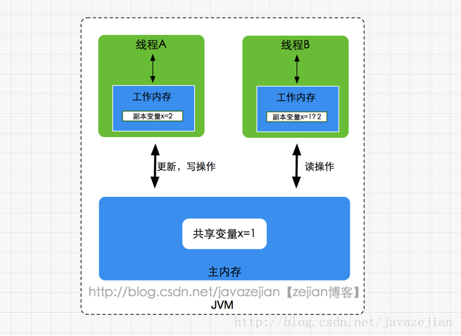

[参考](https://blog.csdn.net/javazejian/article/details/72772461)
### 概述
Java内存模型(即Java Memory Model，简称JMM)本身是一种抽象的概念，并不真实存在，它描述的是一组规则或规范，通过这组规范定义了程序中各个变量（包括实例字段，静态字段和构成数组对象的元素）的访问方式。由于JVM运行程序的实体是线程，而每个线程创建时JVM都会为其创建一个工作内存(有些地方称为栈空间)，用于存储线程私有的数据，而Java内存模型中规定所有变量都存储在主内存，主内存是共享内存区域，所有线程都可以访问，但线程对变量的操作(读取赋值等)必须在工作内存中进行，首先要将变量从主内存拷贝的自己的工作内存空间，然后对变量进行操作，操作完成后再将变量写回主内存，不能直接操作主内存中的变量，工作内存中存储着主内存中的变量副本拷贝，前面说过，工作内存是每个线程的私有数据区域，因此不同的线程间无法访问对方的工作内存，线程间的通信(传值)必须通过主内存来完成，其简要访问过程如下图。

需要注意的是，JMM与Java内存区域的划分是不同的概念层次，更恰当说**JMM描述的是一组规则**，通过这组规则控制程序中各个变量在共享数据区域和私有数据区域的访问方式，JMM是围绕原子性，有序性、可见性展开的(稍后会分析)。JMM与Java内存区域唯一相似点，都存在共享数据区域和私有数据区域，**在JMM中主内存属于共享数据区域，从某个程度上讲应该包括了堆和方法区，而工作内存数据线程私有数据区域，从某个程度上讲则应该包括程序计数器、虚拟机栈以及本地方法栈。**或许在某些地方，我们可能会看见主内存被描述为堆内存，工作内存被称为线程栈，实际上他们表达的都是同一个含义。关于JMM中的主内存和工作内存说明如下
* 主内存
    主要存储的是Java实例对象，所有线程创建的实例对象都存放在主内存中，不管该**实例对象是成员变量还是方法中的本地变量(也称局部变量)**，当然也包括了共享的类信息、常量、静态变量。由于是共享数据区域，多条线程对同一个变量进行访问可能会发现线程安全问题。
* 工作内存
    **主要存储当前方法的所有本地变量信息(工作内存中存储着主内存中的变量副本拷贝)**，每个线程只能访问自己的工作内存，即**线程中的本地变量对其它线程是不可见的**，就算是两个线程执行的是同一段代码，它们也会各自在自己的工作内存中创建属于当前线程的本地变量，当然也包括了字节码行号指示器、相关Native方法的信息。注意由于工作内存是每个线程的私有数据，线程间无法相互访问工作内存，因此存储在工作内存的数据不存在线程安全问题。

弄清楚主内存和工作内存后，接了解一下主内存与工作内存的数据存储类型以及操作方式，根据虚拟机规范，对于一个实例对象中的成员方法而言，如果方法中包含本地变量是基本数据类型（boolean,byte,short,char,int,long,float,double），将直接存储在工作内存的帧栈结构中，但倘若本地变量是引用类型，那么该变量的引用会存储在功能内存的帧栈中，而对象实例将存储在主内存(共享数据区域，堆)中。但**对于实例对象的成员变量，不管它是基本数据类型或者包装类型(Integer、Double等)还是引用类型，都会被存储到堆区**。至于static变量以及类本身相关信息将会存储在主内存中。需要注意的是，在主内存中的实例对象可以被多线程共享，倘若两个线程同时调用了同一个对象的同一个方法，那么两条线程会将要操作的数据拷贝一份到自己的工作内存中，执行完成操作后才刷新到主内存，简单示意图如下所示：

### 硬件内存架构与Java内存模型
#### 硬件内存架构

就目前计算机而言，一般拥有多个CPU并且每个CPU可能存在多个核心，多核是指在一枚处理器(CPU)中集成两个或多个完整的计算引擎(内核),这样就可以支持多任务并行执行，从多线程的调度来说，每个线程都会映射到各个CPU核心中并行运行。在CPU内部有一组CPU寄存器，寄存器是cpu直接访问和处理的数据，是一个临时放数据的空间。一般CPU都会从内存取数据到寄存器，然后进行处理，但由于内存的处理速度远远低于CPU，导致CPU在处理指令时往往花费很多时间在等待内存做准备工作，于是在寄存器和主内存间添加了CPU缓存，CPU缓存比较小，但访问速度比主内存快得多，如果CPU总是操作主内存中的同一址地的数据，很容易影响CPU执行速度，此时CPU缓存就可以把从内存提取的数据暂时保存起来，如果寄存器要取内存中同一位置的数据，直接从缓存中提取，无需直接从主内存取。需要注意的是，寄存器并不每次数据都可以从缓存中取得数据，万一不是同一个内存地址中的数据，那寄存器还必须直接绕过缓存从内存中取数据。所以并不每次都得到缓存中取数据，这种现象有个专业的名称叫做缓存的命中率，从缓存中取就命中，不从缓存中取从内存中取，就没命中，可见缓存命中率的高低也会影响CPU执行性能，这就是CPU、缓存以及主内存间的简要交互过程，总而言之当一个CPU需要访问主存时，会先读取一部分主存数据到CPU缓存(当然如果CPU缓存中存在需要的数据就会直接从缓存获取)，进而在读取CPU缓存到寄存器，当CPU需要写数据到主存时，同样会先刷新寄存器中的数据到CPU缓存，然后再把数据刷新到主内存中。

#### Java线程与硬件处理器
在Window系统和Linux系统上，Java线程的实现是基于一对一的线程模型，所谓的一对一模型，实际上就是通过语言级别层面程序去间接调用系统内核的线程模型，即我们在使用Java线程时，Java虚拟机内部是转而调用当前操作系统的内核线程来完成当前任务。这里需要了解一个术语，内核线程(Kernel-Level Thread，KLT)，它是由操作系统内核(Kernel)支持的线程，这种线程是由操作系统内核来完成线程切换，内核通过操作调度器进而对线程执行调度，并将线程的任务映射到各个处理器上。每个内核线程可以视为内核的一个分身,这也就是操作系统可以同时处理多任务的原因。由于我们编写的多线程程序属于语言层面的，程序一般不会直接去调用内核线程，取而代之的是一种轻量级的进程(Light Weight Process)，也是通常意义上的线程，由于每个轻量级进程都会映射到一个内核线程，因此我们可以通过轻量级进程调用内核线程，进而由操作系统内核将任务映射到各个处理器，这种轻量级进程与内核线程间1对1的关系就称为一对一的线程模型。

如图所示，每个线程最终都会映射到CPU中进行处理，如果CPU存在多核，那么一个CPU将可以并行执行多个线程任务。

#### Java内存模型与硬件内存架构的关系
通过对前面的硬件内存架构、Java内存模型以及Java多线程的实现原理的了解，我们应该已经意识到，多线程的执行最终都会映射到硬件处理器上进行执行，但Java内存模型和硬件内存架构并不完全一致。对于硬件内存来说只有寄存器、缓存内存、主内存的概念，并没有工作内存(线程私有数据区域)和主内存(堆内存)之分，也就是说Java内存模型对内存的划分对硬件内存并没有任何影响，因为JMM只是一种抽象的概念，是一组规则，并不实际存在，不管是工作内存的数据还是主内存的数据，对于计算机硬件来说都会存储在计算机主内存中，当然也有可能存储到CPU缓存或者寄存器中，因此总体上来说，Java内存模型和计算机硬件内存架构是一个相互交叉的关系，是一种抽象概念划分与真实物理硬件的交叉。(注意对于Java内存区域划分也是同样的道理)

### JMM存在的必要性
由于JVM运行程序的实体是线程，而每个线程创建时JVM都会为其创建一个工作内存(有些地方称为栈空间)，用于存储线程私有的数据，线程与主内存中的变量操作必须通过工作内存间接完成，主要过程是将变量从主内存拷贝的每个线程各自的工作内存空间，然后对变量进行操作，操作完成后再将变量写回主内存，如果存在两个线程同时对一个主内存中的实例对象的变量进行操作就有可能诱发线程安全问题。

### 同步操作与规则
1. lock(锁定)：作用于**主内存**的变量，把一个变量标记为一条线程独占状态
1. unlock(解锁)：作用于**主内存**的变量，把一个处于锁定状态的变量释放出来，释放后的变量才可以被其他线程锁定
1. read(读取)：作用于**主内存**的变量，把一个变量值从**主内存**传输到线程的工作内存中，以便随后的load动作使用
1. load(载入)：作用于**工作内存**的变量，它把read操作从**主内存**中得到的变量值放入**工作内存**的变量副本中
1. use(使用)：作用于**工作内存**的变量，把**工作内存**中的一个变量值传递给执行引擎
1. assign(赋值)：作用于**工作内存**的变量，它把一个从执行引擎接收到的值赋给**工作内存**的变量
1. store(存储)：作用于**工作内存**的变量，把**工作内存**中的一个变量的值传送到主内存中，以便随后的write的操作
1. write(写入)：作用于**工作内存**的变量，它把store操作从**工作内存**中的一个变量的值传送到**主内存**的变量中

* 规则：
    1. 不允许read和load、store和write单独出现。即不允许一个变量从主内存读取了但工作内存不接受，或者从工作内从发起会写了但主内存不接受的情况出现。
    1. 不允许一个线程丢弃它的最近的assign操作，即变量在工作内存中改变了之后必须把该变化同步到主内存里。
    1. 不允许一个线程无原因地把数据从线程工作内存同步回主内存中，即没有发生过任何的assign操作就同步到主内存中。
    1. 一个新的变量只能在主内存中诞生，不允许在工作内存中直接使用一个没有被初始化（load或assign）的变量，换句话说，就是对一个变量实施use、store操作之前，必须先执行assign和load操作。
    1. 一个变量在同一时刻，只允许一个线程对其进行loack操作，但lock操作可以被同一个线程重复执行多次，多次执行lock后，只有执行相同次数的unloack操作，变量才能被解锁。
    1. 如果对一个变量执行了lock操作，那将会清空工作内存中此变量的值，在执行引擎使用这个变量前，需要重新执行load或assign操作初始化变量的值。
    1. 如果一个变量事先没有被lock操作锁定，那就不允许对他执行unlock操作，也不允许去unlock一个被其他线程锁定住的变量
    1. 对一个变量执行unlock操作之前，必须先把此变量同步回主内存中（执行store、write操作）。