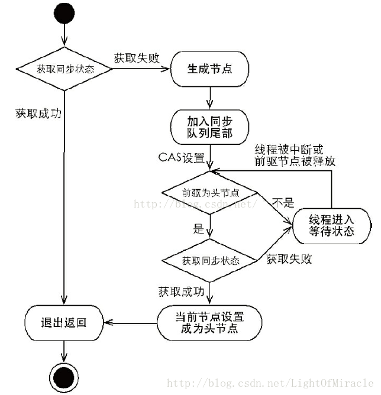
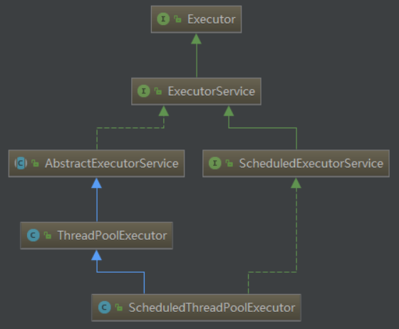

## 三个概念
### 原子性
即一个操作或者多个操作 要么全部执行并且执行的过程不会被任何因素打断，要么就都不执行。
* 在Java中，对**基本数据类型**的变量的读取和赋值操作是原子性操作，即这些操作是不可被中断的，要么执行，要么不执行。

### 可见性
当多个线程访问同一个变量时，一个线程修改了这个变量的值，其他线程能够立即看得到修改的值。
* 提供了volatile关键字来保证可见性。

### 有序性
程序执行的顺序按照代码的先后顺序执行。
* 指令重排序：
    一般来说，处理器为了提高程序运行效率，可能会对输入代码进行优化，它不保证程序中各个语句的执行先后顺序同代码中的顺序一致，但是它会保证程序最终执行结果和代码顺序执行的结果是一致的。
* Java内存模型具备一些先天的“有序性”，即不需要通过任何手段就能够得到保证的有序性，这个通常也称为 happens-before 原则。如果两个操作的执行次序无法从happens-before原则推导出来，那么它们就不能保证它们的有序性，虚拟机可以随意地对它们进行重排序。
* happens-befoe原则：
    * 程序次序规则：一个线程内，按照代码顺序，书写在前面的操作先行发生于书写在后面的操作
    * 锁定规则：一个unLock操作先行发生于后面对同一个锁额lock操作
    * volatile变量规则：对一个变量的写操作先行发生于后面对这个变量的读操作
    * 传递规则：如果操作A先行发生于操作B，而操作B又先行发生于操作C，则可以得出操作A先行发生于操作C
    * 线程启动规则：Thread对象的start()方法先行发生于此线程的每个一个动作
    * 线程中断规则：对线程interrupt()方法的调用先行发生于被中断线程的代码检测到中断事件的发生
    * 线程终结规则：线程中所有的操作都先行发生于线程的终止检测，我们可以通过Thread.join()方法结束、Thread.isAlive()的返回值手段检测到线程已经终止执行
    * 对象终结规则：一个对象的初始化完成先行发生于他的finalize()方法的开始

## synchronized [参考](http://www.cnblogs.com/dolphin0520/p/3923737.html)
如果对临界资源加上互斥锁，当一个线程在访问该临界资源时，其他线程便只能等待。
在Java中，每一个对象都拥有一个**锁标记（monitor）**，也称为监视器，多线程同时访问某个对象时，线程只有获取了该对象的锁才能访问。
在Java中，可以使用synchronized关键字来标记一个方法或者代码块，当某个线程调用该对象的synchronized方法或者访问synchronized代码块时，这个线程便获得了该对象的锁，其他线程暂时无法访问这个方法或方法块，只有等待这个方法执行完毕或者代码块执行完毕，这个线程才会释放该对象的锁，其他线程才能执行这个方法或者代码块。
### synchronized方法
```java
public class Main {
    public static void main(String[] args) {
        final InsertData insertData = new InsertData();

        new Thread(() -> insertData.insert(Thread.currentThread())).start();

        new Thread(() -> insertData.insert(Thread.currentThread())).start();
    }
}

class InsertData {
    private ArrayList<Integer> arrayList = new ArrayList<Integer>();
    
    public void insert(Thread thread) {
        for (int i = 0; i < 20; i++) {
            System.out.println(thread.getName() + "在插入数据" + i);
            arrayList.add(i);
        }
    }
}
```
结果：
```
Thread-0在插入数据0
Thread-0在插入数据1
Thread-0在插入数据2
Thread-0在插入数据3
Thread-1在插入数据0
Thread-0在插入数据4
Thread-1在插入数据1
Thread-0在插入数据5
Thread-1在插入数据2
...
```
说明两个线程在同时执行insert方法。

在insert方法前面加上关键字synchronized
```java
public class InsertData {

    private ArrayList<Integer> arrayList = new ArrayList<Integer>();

    public synchronized void insert(Thread thread) {
        for (int i = 0; i < 20; i++) {
            System.out.println(thread.getName() + "在插入数据" + i);
            arrayList.add(i);
        }
    }
}
```
结果：
```
Thread-0在插入数据0
Thread-0在插入数据1
Thread-0在插入数据2
Thread-0在插入数据3
Thread-0在插入数据4
Thread-0在插入数据5
Thread-0在插入数据6
Thread-0在插入数据7
Thread-0在插入数据8
Thread-0在插入数据9
...
```
从上输出结果说明，Thread-1插入数据是等Thread-0插入完数据之后才进行的。说明Thread-0和Thread-1是顺序执行insert方法的。

注意点：
1. 当一个线程正在访问一个对象的synchronized方法，那么其他线程不能访问该对象的其他synchronized方法。
1. 当一个线程正在访问一个对象的synchronized方法，那么其他线程能访问该对象的非synchronized方法。原因，访问非synchronized方法不需要获得该对象的锁，假如一个方法没用synchronized关键字修饰，说明它不会使用到临界资源，那么其他线程是可以访问这个方法的，
1. 如果一个线程A需要访问对象object1的synchronized方法fun1，另外一个线程B需要访问对象object2的synchronized方法fun1，即使object1和object2是同一类型），也不会产生线程安全问题，因为他们访问的是不同的对象，所以不存在互斥问题。

### synchronized代码块
获取当前对象的锁，也可以是类中的一个属性，代表获取该属性的锁。
```java
class InsertData {
    private ArrayList<Integer> arrayList = new ArrayList<Integer>();
    
    public void insert(Thread thread) {
        synchronized (this) {
            for(int i = 0; i < 100; i++) {
                System.out.println(thread.getName()+"在插入数据"+i);
                arrayList.add(i);
            }
        }
    }
}
```
```java
class InsertData {
    private ArrayList<Integer> arrayList = new ArrayList<Integer>();
    private Object object = new Object();
    
    public void insert(Thread thread) {
        synchronized (object) {
            for(int i = 0; i < 100; i++) {
                System.out.println(thread.getName()+"在插入数据"+i);
                arrayList.add(i);
            }
        }
    }
}
```

<br>
每个类也会有一个锁，它可以用来控制对static数据成员的并发访问。<br>
并且如果一个线程执行一个对象的非static synchronized方法，另外一个线程需要执行这个对象所属类的static synchronized方法，此时不会发生互斥现象，因为访问static synchronized方法占用的是类锁，而访问非static synchronized方法占用的是对象锁，所以不存在互斥现象。

```java
public class Test {

    public static void main(String[] args)  {
        final InsertData insertData = new InsertData();
        new Thread(() -> insertData.insert()).start(); 

        new Thread(() -> insertData.insert1()).start(); 
    }  
}

class InsertData { 
    public synchronized void insert(){
        System.out.println("执行insert");
        try {
            Thread.sleep(5000);
        } catch (InterruptedException e) {
            e.printStackTrace();
        }
        System.out.println("执行insert完毕");
    }
    
    public synchronized static void insert1() {
        System.out.println("执行insert1");
        System.out.println("执行insert1完毕");
    }
}
```
结果：
```
执行insert
执行insert1
执行insert1完毕
执行insert完毕
```

<br>
从反编译获得的字节码可以看出，synchronized代码块实际上多了**monitorenter和monitorexit**两条指令。monitorenter指令执行时会让对象的锁计数加1，而monitorexit指令执行时会让对象的锁计数减1，其实这个与操作系统里面的PV操作很像，操作系统里面的PV操作就是用来控制多个线程对临界资源的访问。

### 释放锁的情况
1. 获取锁的线程执行完了该代码块，然后线程释放对锁的占有；
1. 线程执行发生异常，此时JVM会让线程自动释放锁。

### 缺陷
1. 等待获取锁的线程只能等待获取锁的线程释放锁，影响程序执行效率。
例子：当有多个线程读写文件时，读操作和写操作会发生冲突现象，写操作和写操作会发生冲突现象，但是读操作和读操作不会发生冲突现象。
但是采用synchronized关键字来实现同步的话，就会导致一个问题：
如果多个线程都只是进行读操作，所以当一个线程在进行读操作时，其他线程只能等待无法进行读操作。


## Lock [参考](http://www.cnblogs.com/dolphin0520/p/3923167.html)
### Lock接口
```java
public interface Lock {
    void lock();
    void lockInterruptibly() throws InterruptedException;
    boolean tryLock();
    boolean tryLock(long time, TimeUnit unit) throws InterruptedException;
    void unlock();
    Condition newCondition();
}
```
lock()、tryLock()、tryLock(long time, TimeUnit unit)和lockInterruptibly()是用来获取锁的。unLock()方法是用来释放锁的。
* lock()
    用来获取锁。如果锁已被其他线程获取，则进行等待。
    一般来说，使用Lock必须在try{}catch{}块中进行，并且将释放锁的操作放在finally块中进行，以保证锁一定被被释放，防止死锁的发生。
    ```java
    Lock lock = ...;
    lock.lock();
    try {
        //处理任务
    } catch(Exception ex) {
        
    } finally {
        lock.unlock();   //释放锁
    }
    ```

* tryLock()
    有返回值的，它表示用来尝试获取锁，如果获取成功，则返回true，如果获取失败（即锁已被其他线程获取），则返回false，也就说这个方法无论如何都会立即返回。在拿不到锁时不会一直在那等待。

* tryLock(long time, TimeUnit unit)
    与tryLock()方法是类似的，只不过区别在于这个方法在拿不到锁时会等待一定的时间，在时间期限之内如果还拿不到锁，就返回false。如果如果一开始拿到锁或者在等待期间内拿到了锁，则返回true。
    ```java
    Lock lock = ...;
    if (lock.tryLock()) {
        try {
            //处理任务
        } catch(Exception ex) {
            
        } finally {
            lock.unlock();   //释放锁
        } 
    } else {
        //如果不能获取锁，则直接做其他事情
    }
    ```

* lockInteruptibly()
    lockInterruptibly()方法比较特殊，当通过这个方法去获取锁时，如果线程正在等待获取锁，则这个线程能够响应中断，即中断线程的等待状态。也就使说，当两个线程同时通过lock.lockInterruptibly()想获取某个锁时，假若此时线程A获取到了锁，而线程B只有在等待，那么对线程B调用threadB.interrupt()方法能够中断线程B的等待过程。
    由于lockInterruptibly()的声明中抛出了异常，所以lock.lockInterruptibly()必须放在try块中或者在调用lockInterruptibly()的方法外声明抛出InterruptedException。
    ```java
    public void method() throws InterruptedException {
        lock.lockInterruptibly();
        try {  
            //.....
        } finally {
            lock.unlock();
        }  
    }
    ```
    注意，**当一个线程获取了锁之后，是不会被interrupt()方法中断的。**因为本身在前面的文章中讲过单独调用interrupt()方法不能中断正在运行过程中的线程，只能中断阻塞过程中的线程。
    因此当通过lockInterruptibly()方法获取某个锁时，如果不能获取到，只有进行等待的情况下，是可以响应中断的。
    而用synchronized修饰的话，当一个线程处于等待某个锁的状态，是无法被中断的，只有一直等待下去。

### ReentrantLock
“可重入锁”，唯一实现了Lock接口的类。
* lock()
    ```java
    public class Test {
        private ArrayList<Integer> arrayList = new ArrayList<Integer>();
        private Lock lock = new ReentrantLock();    //注意这个地方，类成员

        public static void main(String[] args) {
            final Test test = new Test();

            new Thread(() -> test.testLock(Thread.currentThread())).start();
            new Thread(() -> test.testLock(Thread.currentThread())).start();
        }

        public void testLock(Thread thread) {
            lock.lock();
            try {
                System.out.println(thread.getName() + "得到了锁");
                for (int i = 0; i < 3; i++) {
                    arrayList.add(i);
                    System.out.println(i);
                }
            } catch (Exception e) {
                // TODO: handle exception
            } finally {
                System.out.println(thread.getName() + "释放了锁");
                lock.unlock();
            }
        }
    }
    ```
    结果：
    ```java
    Thread-0得到了锁
    0
    1
    2
    Thread-0释放了锁
    Thread-1得到了锁
    0
    1
    2
    Thread-1释放了锁
    ```

* tryLock()
    ```java
    public void testTryLock(Thread thread) {
        if (lock.tryLock()) {
            try {
                System.out.println(thread.getName() + "得到了锁");
                for (int i = 0; i < 3; i++) {
                    arrayList.add(i);
                }
            } catch (Exception e) {
                // TODO: handle exception
            } finally {
                System.out.println(thread.getName() + "释放了锁");
                lock.unlock();
            }
        } else {
            System.out.println(thread.getName() + "获取锁失败");
        }
    }
    ```
    结果：
    ```
    Thread-0得到了锁
    Thread-1获取锁失败
    Thread-0释放了锁
    ```

* lockInterruptibly()
    ```java
    public class Test {
        private ArrayList<Integer> arrayList = new ArrayList<Integer>();
        private Lock lock = new ReentrantLock();    //注意这个地方

        public static void main(String[] args) {
            final Test test = new Test();

            Thread thread1 = new TestLockInterruptiblyThread(test);
            Thread thread2 = new TestLockInterruptiblyThread(test);
            thread1.start();
            thread2.start();

            try {
                Thread.sleep(2000);
            } catch (InterruptedException e) {
                e.printStackTrace();
            }
            thread2.interrupt();
        }

        public void testLockInterruptibly(Thread thread) throws InterruptedException {
            lock.lockInterruptibly();   //注意，如果需要正确中断等待锁的线程，必须将获取锁放在外面，然后将InterruptedException抛出
            try {
                System.out.println(thread.getName() + "得到了锁");
                long startTime = System.currentTimeMillis();
                for (; ; ) {
                    if (System.currentTimeMillis() - startTime >= 60000)
                        break;
                    //插入数据
                }
            } finally {
                System.out.println(Thread.currentThread().getName() + "执行finally");
                lock.unlock();
                System.out.println(thread.getName() + "释放了锁");
            }
        }
    }

    class TestLockInterruptiblyThread extends Thread {
        private Test test = null;
        public TestLockInterruptiblyThread(Test test) {
            this.test = test;
        }
        @Override
        public void run() {
            try {
                test.testLockInterruptibly(Thread.currentThread());
            } catch (InterruptedException e) {
                System.out.println(Thread.currentThread().getName()+"被中断");
            }
        }
    }
    ```
    结果：
    ```
    Thread-0得到了锁
    Thread-1被中断
    Thread-0执行finally
    Thread-0释放了锁
    ```

### ReadWriteLock接口
```java
public interface ReadWriteLock {
    Lock readLock();
    Lock writeLock();
}
```

### ReentrantReadWriteLock
```java
public class Test {
    private ReentrantReadWriteLock rwl = new ReentrantReadWriteLock();
     
    public static void main(String[] args)  {
        final Test test = new Test();
         
        new Thread(() -> test.get(Thread.currentThread())).start();
        new Thread(() -> test.get(Thread.currentThread())).start();
    }  
     
    public void get(Thread thread) {
        rwl.readLock().lock();
        try {
            long start = System.currentTimeMillis();
             
            while(System.currentTimeMillis() - start <= 1) {
                System.out.println(thread.getName()+"正在进行读操作");
            }
            System.out.println(thread.getName()+"读操作完毕");
        } finally {
            rwl.readLock().unlock();
        }
    }
}
```
结果：
```
Thread-0正在进行读操作
Thread-0正在进行读操作
Thread-1正在进行读操作
Thread-0正在进行读操作
Thread-1正在进行读操作
Thread-0正在进行读操作
Thread-1正在进行读操作
Thread-1正在进行读操作
Thread-1正在进行读操作
Thread-1正在进行读操作
Thread-1正在进行读操作
Thread-1正在进行读操作
Thread-0正在进行读操作
Thread-0正在进行读操作
...
```
说明thread1和thread2在同时进行读操作。
这样就大大提升了读操作的效率。
不过要注意的是，如果有一个线程已经占用了读锁，则此时其他线程如果要申请写锁，则申请写锁的线程会一直等待释放读锁。
如果有一个线程已经占用了写锁，则此时其他线程如果申请写锁或者读锁，则申请的线程会一直等待释放写锁。

## Lock VS synchronized
1. Lock是一个接口，而synchronized是Java中的关键字，synchronized是内置的语言实现；
1. synchronized在发生异常时，会自动释放线程占有的锁，因此不会导致死锁现象发生；而Lock在发生异常时，如果没有主动通过unLock()去释放锁，则很可能造成死锁现象，因此使用Lock时需要在finally块中释放锁；
1. Lock可以让等待锁的线程响应中断，而synchronized却不行，使用synchronized时，等待的线程会一直等待下去，不能够响应中断；
1. 通过Lock可以知道有没有成功获取锁，而synchronized却无法办到。
1. Lock可以提高多个线程进行读操作的效率。
1. 当竞争资源非常激烈时（即有大量线程同时竞争），此时Lock的性能要远远优于synchronized。

## 锁
### 可重入锁
表明了锁的分配机制：基于线程的分配，而不是基于方法调用的分配。
例子：当一个线程执行到某个synchronized方法时，比如说method1，而在method1中会调用另外一个synchronized方法method2，此时线程不必重新去申请锁，而是可以直接执行方法method2。
```java
class MyClass {
    public synchronized void method1() {
        method2();
    }
     
    public synchronized void method2() {
         
    }
}
```
ReentrantLock 和synchronized 都是可重入锁。可重入锁最大的作用是**避免死锁**。

### 公平锁
尽量以请求锁的顺序来获取锁。比如同是有多个线程在等待一个锁，当这个锁被释放时，等待时间最久的线程（最先请求的线程）会获得该所，这种就是公平锁。
* synchronized就是非公平锁，它无法保证等待的线程获取锁的顺序。
* 而对于ReentrantLock和ReentrantReadWriteLock，它默认情况下是非公平锁，但是可以设置为公平锁。


## volatile [参考](http://www.cnblogs.com/dolphin0520/p/3920373.html)
### 两层含义
1. 保证了不同线程对这个变量进行操作时的可见性，即一个线程修改了某个变量的值，这新值对其他线程来说是立即可见的。
1. 禁止进行指令重排序。
### 不能保证原子性
自增操作是不具备原子性的，它包括读取变量的原始值、进行加1操作、写入工作内存。
### 在一定程序上保证有序性
* 禁止进行指令重排序两层含义
    1. 当程序执行到volatile变量的读操作或者写操作时，在其前面的操作的更改肯定全部已经进行，且结果已经对后面的操作可见；在其后面的操作肯定还没有进行；
    1. 在进行指令优化时，不能将在对volatile变量访问的语句放在其后面执行，也不能把volatile变量后面的语句放到其前面执行。


## ThreadLocal
提供的方法：
```java
public T get() { }
public void set(T value) { }
public void remove() { }
protected T initialValue() { }
```
get()方法是用来获取ThreadLocal在当前线程中保存的变量副本，set()用来设置当前线程中变量的副本，remove()用来移除当前线程中变量的副本，initialValue()是一个protected方法，一般是用来在使用时进行重写的，它是一个延迟加载方法。

### 如何为每个线程创建一个变量的副本
1. 首先，在每个线程Thread内部有一个ThreadLocal.ThreadLocalMap类型的成员变量threadLocals，这个threadLocals就是用来存储实际的变量副本的，键值为当前ThreadLocal变量，value为变量副本（即T类型的变量）。
1. 初始时，在Thread里面，threadLocals为空，当通过ThreadLocal变量调用get()方法或者set()方法，就会对Thread类中的threadLocals进行初始化，并且以当前ThreadLocal变量为键值，以ThreadLocal要保存的副本变量为value，存到threadLocals。
1. 然后在当前线程里面，如果要使用副本变量，就可以通过get方法在threadLocals里面查找。

* 注意：
1. 实际的通过ThreadLocal创建的副本是存储在每个线程自己的threadLocals中的；
2. 为何threadLocals的类型ThreadLocalMap的键值为ThreadLocal对象，因为每个线程中可有多个threadLocal变量，就像上面代码中的longLocal和stringLocal；
3. 在进行get之前，必须先set，否则会报空指针异常；

### 适用场景
如上文所述，ThreadLocal 适用于如下两种场景
1. 每个线程需要有自己单独的实例
    每个线程拥有自己实例，实现它的方式很多。例如可以在线程内部构建一个单独的实例。ThreadLocal 可以以非常方便的形式满足该需求。
1. 实例需要在多个方法中共享，但不希望被多线程共享
    可以在满足第一点（每个线程有自己的实例）的条件下，通过方法间引用传递的形式实现。ThreadLocal 使得代码耦合度更低，且实现更优雅。

### 总结
* ThreadLocal 并不解决线程间共享数据的问题。
* ThreadLocal 通过隐式的在不同线程内创建独立实例副本避免了实例线程安全的问题。
* 每个线程持有一个 Map 并维护了 ThreadLocal 对象与具体实例的映射，该 Map 由于只被持有它的线程访问，故不存在线程安全以及锁的问题。
* ThreadLocalMap 的 Entry 对 ThreadLocal 的引用为弱引用，避免了 ThreadLocal 对象无法被回收的问题。
* ThreadLocalMap 的 set 方法通过调用 replaceStaleEntry 方法回收键为 null 的 Entry 对象的值（即为具体实例）以及 Entry 对象本身从而防止内存泄漏。
* ThreadLocal 适用于变量在线程间隔离且在方法间共享的场景。


## ConcurrentModificationException
### 原因
```java
public class Test {
    public static void main(String[] args)  {
        ArrayList<Integer> list = new ArrayList<Integer>();
        list.add(2);
        Iterator<Integer> iterator = list.iterator();
        while(iterator.hasNext()){
            Integer integer = iterator.next();
            if(integer==2)
                list.remove(integer);
        }
    }
}
```
结果：
```
Exception in thread "main" java.util.ConcurrentModificationException
	at java.util.ArrayList$Itr.checkForComodification(ArrayList.java:907)
	at java.util.ArrayList$Itr.next(ArrayList.java:857)
	at Test.testConcurrentModificationException(Test.java:107)
	at Test.main(Test.java:26)
```

```java
public boolean remove(Object o) {
    if (o == null) {
        for (int index = 0; index < size; index++)
            if (elementData[index] == null) {
                fastRemove(index);
                return true;
            }
    } else {
        for (int index = 0; index < size; index++)
            if (o.equals(elementData[index])) {
                fastRemove(index);
                return true;
            }
    }
    return false;
}

private void fastRemove(int index) {
    modCount++;
    int numMoved = size - index - 1;
    if (numMoved > 0)
        System.arraycopy(elementData, index+1, elementData, index,
                numMoved);
    elementData[--size] = null; // Let gc do its work
}
```
通过remove(Object o)方法删除元素最终是调用的fastRemove()方法，在fastRemove()方法中，首先对modCount进行加1操作（因为对集合修改了一次），然后接下来就是删除元素的操作，最后将size进行减1操作，并将引用置为null以方便垃圾收集器进行回收工作。
此时，modCount不等于expectedModCount，则抛出ConcurrentModificationException异常。
关键点就在于：**调用list.remove(Object o)方法导致modCount和expectedModCount的值不一致。**

### 单线程解决方案
Itr类中有
```java
public void remove() {
    if (lastRet == -1)
        throw new IllegalStateException();
    checkForComodification();
 
    try {
        AbstractList.this.remove(lastRet);
    if (lastRet < cursor)
        cursor--;
    lastRet = -1;
    expectedModCount = modCount;    // 这句重要
    } catch (IndexOutOfBoundsException e) {
        throw new ConcurrentModificationException();
    }
}
```
所以，只要调用Itr类的remove()即可。

### 多线程解决方案
```java
public class Test {
    static ArrayList<Integer> list = new ArrayList<Integer>();
    public static void main(String[] args)  {
        list.add(1);
        list.add(2);
        list.add(3);
        list.add(4);
        list.add(5);
        Thread thread1 = new Thread(){
            public void run() {
                Iterator<Integer> iterator = list.iterator();
                while(iterator.hasNext()){
                    Integer integer = iterator.next();
                    System.out.println(integer);
                    try {
                        Thread.sleep(100);
                    } catch (InterruptedException e) {
                        e.printStackTrace();
                    }
                }
            };
        };
        Thread thread2 = new Thread(){
            public void run() {
                Iterator<Integer> iterator = list.iterator();
                while(iterator.hasNext()){
                    Integer integer = iterator.next();
                    if(integer==2)
                        iterator.remove(); 
                }
            };
        };
        thread1.start();
        thread2.start();
    }
}
```
虽然Vector的方法采用了synchronized进行了同步，但是实际上通过Iterator访问的情况下，每个线程里面返回的是不同的iterator，也即是说expectedModCount是每个线程私有。假若此时有2个线程，线程1在进行遍历，线程2在进行修改，那么很有可能**导致线程2修改后导致Vector中的modCount自增了，线程2的expectedModCount也自增了，但是线程1的expectedModCount没有自增**，此时线程1遍历时就会出现expectedModCount不等于modCount的情况了。

解决方案：
1. 在使用iterator迭代的时候使用synchronized或者Lock进行同步；
1. 使用并发容器CopyOnWriteArrayList代替ArrayList和Vector。


## CAS
### 无锁概念
对于乐观派而言，他们认为事情总会往好的方向发展，总是认为坏的情况发生的概率特别小，可以无所顾忌地做事；但对于悲观派而已，他们总会认为发展事态如果不及时控制，以后就无法挽回了，即使无法挽回的局面几乎不可能发生。
这两种派系映射到并发编程中就如同加锁与无锁的策略，即加锁是一种悲观策略，无锁是一种乐观策略。因为对于加锁的并发程序来说，它们总是认为每次访问共享资源时总会发生冲突，因此必须对每一次数据操作实施加锁策略。而无锁则总是假设对共享资源的访问没有冲突，线程可以不停执行，无需加锁，无需等待，一旦发现冲突，无锁策略则采用一种称为CAS的技术来保证线程执行的安全性，这项CAS技术就是无锁策略实现的关键。

### 核心算法
CAS的全称是 Compare And Swap，即比较交换。
CAS 中包含3个参数
* V 内存值
* A 旧的预期值
* B 要修改的新值

1. 如果V值等于A值，则将V值设置成B；
1. 若V值不等于A值，说明已有其他线程做了更新，可以选择重新读取该变量再尝试再次修改该变量，也可以放弃操作。

### Unsafe类
Unsafe类存在于sun.misc包中，其内部方法操作可以像C的指针一样直接操作内存，单从名称看来就可以知道该类是非安全的，毕竟Unsafe拥有着类似于C的指针操作，因此总是不应该首先使用Unsafe类，Java官方也不建议直接使用的Unsafe类，但我们还是很有必要了解该类，因为Java中CAS操作的执行依赖于Unsafe类的方法，注意Unsafe类中的所有方法都是native修饰的。

#### CAS相关操作
```java
//第一个参数o为给定对象，offset为对象内存的偏移量，通过这个偏移量迅速定位字段并设置或获取该字段的值，
//expected表示期望值，x表示要设置的值，下面3个方法都通过CAS原子指令执行操作。
public final native boolean compareAndSwapObject(Object o, long offset,Object expected, Object x);                                                                                                  
 
public final native boolean compareAndSwapInt(Object o, long offset,int expected,int x);
 
public final native boolean compareAndSwapLong(Object o, long offset,long expected,long x);
```

### Atomic包
#### 基本类型
* AtomicBoolean：原子更新布尔类型
* AtomicInteger：原子更新整型
* AtomicLong：原子更新长整型

#### 实现原理（AtomicInteger为例）
```java
static {
    try {
        //通过unsafe类的objectFieldOffset()方法，获取value变量在对象内存中的偏移
        //通过该偏移量valueOffset，unsafe类的内部方法可以获取到变量value对其进行取值或赋值操作
        valueOffset = unsafe.objectFieldOffset
            (AtomicInteger.class.getDeclaredField("value"));
    } catch (Exception ex) { throw new Error(ex); }
}
```
```java
public final int getAndIncrement() {
    return unsafe.getAndAddInt(this, valueOffset, 1);
}

/**
 * getAndAddInt通过一个while循环不断的重试更新要设置的值，直到成功为止，
 * 调用的是Unsafe类中的compareAndSwapInt方法，是一个CAS操作方法。
 */
public final int getAndAddInt(Object var1, long var2, int var4) {
    int var5;
    do {
        var5 = this.getIntVolatile(var1, var2);
    } while(!this.compareAndSwapInt(var1, var2, var5, var5 + var4));

    return var5;
}
```

### ABA问题及解决方案
* 问题：
    假设这样一种场景，当第一个线程执行CAS(V,E,U)操作，在获取到当前变量V，准备修改为新值U前，另外两个线程已连续修改了两次变量V的值，使得该值又恢复为旧值，这样的话，我们就无法正确判断这个变量是否已被修改过。
* 解决：
    使用原子类：
    AtomicStampedReference类
    * AtomicStampedReference原子类
        是一个带有时间戳的对象引用，在每次修改后，AtomicStampedReference不仅会设置新值而且还会记录更改的时间。当AtomicStampedReference设置对象值时，对象值以及时间戳都必须满足期望值才能写入成功，这也就解决了反复读写时，无法预知值是否已被修改的窘境。
        * 底层实现：
            ```java
            private static class Pair<T> {
                final T reference;
                final int stamp;
                private Pair(T reference, int stamp) {
                    this.reference = reference;
                    this.stamp = stamp;
                }
                static <T> Pair<T> of(T reference, int stamp) {
                    return new Pair<T>(reference, stamp);
                }
            }

            public boolean compareAndSet(V   expectedReference,
                                 V   newReference,
                                 int expectedStamp,
                                 int newStamp) {
                Pair<V> current = pair;
                return
                    expectedReference == current.reference &&
                    expectedStamp == current.stamp &&
                    ((newReference == current.reference &&
                    newStamp == current.stamp) ||
                    casPair(current, Pair.of(newReference, newStamp)));
            }
            ```


## AQS [参考1](https://www.cnblogs.com/waterystone/p/4920797.html) [参考2](https://blog.csdn.net/lightofmiracle/article/details/73104926)
### 框架

它维护了一个volatile int state（代表共享资源）和一个FIFO线程等待队列（多线程争用资源被阻塞时会进入此队列）。state访问方式有三种：
* getState()
* setState(int newState)
* compareAndSetState(int expect, int update)

AQS定义了两种资源共享方式：Exclusive（独占，只有一个线程能执行，如ReentrantLock）和Share（共享，多个线程可同时执行，如Semaphore/CountDownLatch）。
不同的自定义同步器争用共享资源的方式也不同。**自定义同步器在实现时只需要实现共享资源state的获取与释放方式即可**，至于具体线程等待队列的维护（如获取资源失败入队/唤醒出队等），AQS已经在顶层实现好了。
自定义同步器实现主要实现以下几种方法：
* isHeldExclusiveLy()：该线程是否正在独占资源。只有用到condition才需要去实现它。
* tryAcquire(int)：独占方式。尝试获取资源，成功则返回true，失败则返回false。
* tryRelease()：独占方式。尝试释放资源，成功则返回true，失败则返回false。
* tryAcquireShared(int)：共享方式。尝试获取资源，负数表示失败；0表示成功，但没有剩余可用资源；正数表示成功，且有剩余资源。
* tryReleaseShared(int)：共享方式。尝试释放资源，如果释放后允许唤醒后序等待结点返回true，否则返回false。

### 整体函数流程
#### 独占模式 Exclusive
* 获取锁
    1. acquire() 独占模式下线程获取共享资源的顶层入口；
    1. tryAcquire() 尝试直接去获取资源，如果成功则直接返回；
    1. addWaiter() 将该线程加入等待队列的尾部，并标记为独占模式；
    1. acquireQueued() 使线程在等待队列中获取资源，直到获取到资源后才返回。如果在整个等待过程中被中断过，则返回true，否则返回false；
    1. 如果线程在等待过程中被中断过，它是不响应的。只是获取资源后才**再进行自我中断selfInterrupt()，将中断补上**。
* 释放锁
    1. release() 独占模式下线程释放共享资源的顶层入口；
    1. tryRelease() 尝试去释放指定量的资源；
    1. unparkSuccessor() 唤醒等待队列中下一个线程。

#### 共享模式 Share
* 获取锁
    1. acquireShared() 共享模式下线程获取共享资源的顶层入口；
    1. tryAcquireShared()尝试获取资源，成功则直接返回；
    1. 失败则通过doAcquireShared()进入等待队列，直到获取到资源为止才返回。
* 释放锁
    1. releaseShared() 共享模式下线程释放共享资源的顶层入口；
    1. tryReleaseShared(int) 尝试释放资源；
    1. doReeaseShared(int) 唤醒后继结点。

### 数据结构
Node结点
```java
static final class Node {
    // 共享模式下等待获取同步状态
    static final Node SHARED = new Node();
    // 独占式模式下等待获取同步状态
    static final Node EXCLUSIVE = null;
    // 当前线程已经取消了（由于中断或者超时）
    static final int CANCELLED =  1;
    // 当前线程释放同步状态之后需要去唤醒后继节点
    static final int SIGNAL    = -1;
    // 表明线程在Condition队列中等待，在状态被转换之前将不会被作为同步队列节点对待
    static final int CONDITION = -2;
    // 表示头节点在共享的释放同步状态后需要传播到其他的节点
    static final int PROPAGATE = -3;
    // 等待状态
    volatile int waitStatus;
    // 前驱节点
    volatile Node prev;
    // 后继节点
    volatile Node next;
    volatile Thread thread;

    //下一个在condition队列中等待的节点。因为condition队列中只保存独占式的节点，
    //所以用nextWaiter来指向condition中的节点以表示SHRED模式下的节点
    Node nextWaiter;

    //是否为SHARED模式
    final boolean isShared() {
        return nextWaiter == SHARED;
    }

    //获取前驱节点
    final Node predecessor() throws NullPointerException {
        Node p = prev;
        if (p == null)
            throw new NullPointerException();
        else
            return p;
    }
    //构造函数
    Node() {    // Used to establish initial head or SHARED marker
    }

    Node(Thread thread, Node mode) {     // Used by addWaiter
        this.nextWaiter = mode;
        this.thread = thread;
    }

    Node(Thread thread, int waitStatus) { // Used by Condition
        this.waitStatus = waitStatus;
        this.thread = thread;
    }
}
```

### 独占 Exclusive
#### 获取锁
* acquire(int)
    此方法是独占模式下线程获取共享资源的顶层入口。
    如果获取到资源，线程直接返回，否则进入等待队列，获取获取到资源为止，**且整个过程忽略中断的影响**。
    ```java
    public final void acquire(int arg) {
        if (!tryAcquire(arg) &&
            acquireQueued(addWaiter(Node.EXCLUSIVE), arg))
            selfInterrupt();
    }
    ```
    函数流程：
    1. tryAcquire() 尝试直接去获取资源，如果成功则直接返回；
    1. addWaiter() 将该线程加入等待队列的尾部，并标记为独占模式；
    1. acquireQueued() 使线程在等待队列中获取资源，直到获取到资源后才返回。如果在整个等待过程中被中断过，则返回true，否则返回false；
    1. 如果线程在等待过程中被中断过，它是不响应的。只是获取资源后才**再进行自我中断selfInterrupt()，将中断补上**。

* tryAcquire(int)
    此方法尝试去获取独占资源。如果获取成功，则直接返回true，否则直接返回false。
    ```java
    protected boolean tryAcquire(int arg) {
        throw new UnsupportedOperationException();
    }
    ```
    AQS这里只定义了一个接口，具体资源的获取交由自定义同步器去实现了（通过state的get/set/CAS）。

* addWaiter(Node)
    此方法用于将当前线程加入到等待队列的队尾，并返回当前线程所在的结点。
    ```java
    private Node addWaiter(Node mode) {
        // 以给定模式构造结点。mode有两种：EXCLUSIVE（独占）和SHARED（共享）
        Node node = new Node(Thread.currentThread(), mode);
        
        // 尝试快速方式直接放到队尾
        Node pred = tail;
        if (pred != null) {
            node.prev = pred;
            // CAS方式
            if (compareAndSetTail(pred, node)) {
                pred.next = node;
                return node;
            }
        }

        // 无法通过快速方式放入队尾，则通过enq方式
        enq(node);
        return node;
    }

    private Node enq(final Node node) {
        // CAS方式“自旋”，直到成功加入队尾
        for (;;) {
            Node t = tail;
            // 队列为空，创建一个空的标志结点作为head结点，并将tail也指向它。
            if (t == null) { // Must initialize
                if (compareAndSetHead(new Node()))
                    tail = head;
            } else { // 正常流程，放入队尾
                node.prev = t;
                if (compareAndSetTail(t, node)) {
                    t.next = node;
                    return t;
                }
            }
        }
    }
    ```

* acquireQueued(Node, int)
    通过tryAcquire()和addWaiter()，该线程获取资源失败，已经被放入等待队列尾部了。线程进入等待状态休息，直到其他线程彻底释放资源后唤醒自己，自己再拿到资源，在执行。
    主要做了两件事 
    1. 使当前节点的上一个节点的状态为SIGNAL状态. 
    2. 阻塞当前节点的线程
    ```java
    final boolean acquireQueued(final Node node, int arg) {
        // 标记是否成功拿到资源
        boolean failed = true;
        try {
            // 标记等待过程中是否被中断过
            boolean interrupted = false;

            // “自旋”
            for (;;) {
                // 拿到node的前驱
                final Node p = node.predecessor();
                // 如果前驱是head，则尝试去获取资源
                if (p == head && tryAcquire(arg)) {
                    setHead(node);
                    p.next = null; // help GC
                    failed = false;
                    // 返回等待过程中是否被中断过
                    return interrupted;
                }
                
                // 在线程可以进入waiting状态时，进行park()，进入waitting状态，直到被unpark()
                if (shouldParkAfterFailedAcquire(p, node) &&
                    parkAndCheckInterrupt())
                    // 处在waiting状态时，将interrupted标记为true
                    interrupted = true;
            }
        } finally {
            if (failed)
                cancelAcquire(node);
        }
    }

    private static boolean shouldParkAfterFailedAcquire(Node pred, Node node) {
        int ws = pred.waitStatus;
        if (ws == Node.SIGNAL)
            // 如果是SIGNAL（-1）状态，那么说明当前线程已经设置了如果前驱节点释放同步状态的话将会唤醒自己
            // 可以安全进入waitting状态
            return true;
        if (ws > 0) {
            // 如果大于0说明前驱节点已经cancel了，那么就跳过前去节点一直往前找，直到找到等待状态小于等于0的节点。
            do {
                node.prev = pred = pred.prev;
            } while (pred.waitStatus > 0);
            pred.next = node;
        } else {
            // 表示当前线程需要一个single信号来唤醒自己，设置前驱节点的等待状态位single（-1）
            // 同时使用的的CAS方式可能会失败，所以不阻塞线程因为可能还需要调用这个方法
            compareAndSetWaitStatus(pred, ws, Node.SIGNAL);
        }
        return false;
    }

    private final boolean parkAndCheckInterrupt() {
        // 调用park()使线程进入waiting状态，阻塞线程
        LockSupport.park(this);
        return Thread.interrupted();
    }
    ```
    park()会让当前线程进入waiting状态。在此状态下，有两种途径可以唤醒该线程：
    1. 被unpark()；
    1. 被interrupt()
    需要注意的是，Thread.interrupted()会清除当前线程的中断标记位。 

* 小结
    
    流程：
    1. 调用自定义同步器的tryAcquire()尝试直接去获取资源，如果成功则直接返回；
    1. 没成功，则addWaiter()将该线程加入等待队列的尾部，并标记为独占模式；
    1. acquireQueued()使线程在等待队列中休息，有机会时（轮到自己，会被unpark()）会去尝试获取资源。获取到资源后才返回。如果在整个等待过程中被中断过，则返回true，否则返回false。
    1. 如果线程在等待过程中被中断过，它是不响应的。只是获取资源后才再进行自我中断selfInterrupt()，将中断补上。

#### 释放锁
* release(int)
    此方法是独占模式下线程释放共享资源的顶层入口。它会释放指定量的资源，如果彻底释放了（即state=0）,它会唤醒等待队列里的其他线程来获取资源。
    它是根据tryRelease()的返回值来判断该线程是否已经完成释放掉资源了！所以自定义同步器在设计tryRelease()的时候要明确这一点！
    ```java
    public final boolean release(int arg) {
        if (tryRelease(arg)) {
            // 获取头结点
            Node h = head;
            if (h != null && h.waitStatus != 0)
                // 唤醒等待队列里的下一个线程
                unparkSuccessor(h);
            return true;
        }
        return false;
    }
    ```
    函数流程：
    1. tryRelease() 尝试去释放指定量的资源；
    1. unparkSuccessor() 唤醒等待队列中下一个线程。

* tryRelease(int)
    此方法尝试去释放指定量的资源。
    正常来说，tryRelease()都会成功的，因为这是独占模式，该线程来释放资源，那么它肯定已经拿到独占资源了，直接减掉相应量的资源即可(state-=arg)，也不需要考虑线程安全的问题。
    ```java
    protected boolean tryRelease(int arg) {
        throw new UnsupportedOperationException();
    }
    ```

* unparkSuccessor(Node)
    此方法用于唤醒等待队列中下一个线程。
    ```java
    private void unparkSuccessor(Node node) {
        // node 一般为当前线程所在结点
        int ws = node.waitStatus;
        if (ws < 0)
            compareAndSetWaitStatus(node, ws, 0);

        // 获取node的后继结点
        Node s = node.next;
        // 如果为空或已取消
        if (s == null || s.waitStatus > 0) {
            s = null;
            // 找到下一个需要唤醒的结点
            for (Node t = tail; t != null && t != node; t = t.prev)
                if (t.waitStatus <= 0)
                    s = t;
        }
        if (s != null)
            LockSupport.unpark(s.thread);
    }
    ```

* 与acquireQueued()联系
    s 代表唤醒等待队列中最前边的未放弃的线程。
    s被唤醒后（unpark()），进入 if (p == head && tryAcquire(arg)) 判断（即使p!=head也没关系，它会再进入shouldParkAfterFailedAcquire()寻找一个安全点。这里既然s已经是等待队列中最前边的那个未放弃线程了，那么通过shouldParkAfterFailedAcquire()的调整，s也必然会跑到head的next结点，下一次自旋p==head就成立啦），然后s把设置成head，表示自己已经获得资源，接着acquire()也返回。

### 共享 Share
#### 获取锁
* acquireShared(int)
    此方法是共享模式下线程获取共享资源的顶层入口。
    它会获取指定量的资源，获取成功则直接返回，获取失败则进入等待队列，直到获取到资源为止，整个过程忽略中断。
    ```java
    public final void acquireShared(int arg) {
        if (tryAcquireShared(arg) < 0)
            doAcquireShared(arg);
    }
    ```
    流程：
    1. tryAcquireShared() 尝试获取资源，成功则直接返回；
    1. 失败则通过doAcquireShared()进入等待队列，直到获取到资源为止。

* tryAcquireShared(int)
    此方法尝试去获取指定量的资源。
    ```java
    protected int tryAcquireShared(int arg) {
        throw new UnsupportedOperationException();
    }
    ```
    返回值：
    * 负值代表获取失败；
    * 0代表获取成功，但没有剩余资源；
    * 正数表示获取成功，还有剩余资源，其他线程还可以去获取。

* doAcquireShared(int)
    与acquireQueued()相似
    ```java
    private void doAcquireShared(int arg) {
        // 加入队列尾部
        final Node node = addWaiter(Node.SHARED);
        // 是否成功标志
        boolean failed = true;
        try {
            // 等待过程中是否被中断过的标志
            boolean interrupted = false;
            // 自旋
            for (;;) {
                // 获得前驱
                final Node p = node.predecessor();
                if (p == head) { // 如果前驱为head
                    // 尝试获取资源
                    int r = tryAcquireShared(arg);
                    if (r >= 0) { // 成功获取资源
                        // 将head指向自己，还有剩余资源可以再唤醒之后的线程
                        setHeadAndPropagate(node, r);
                        p.next = null; // help GC
                        if (interrupted) // 如果等待过程中被打断过，则此时将中断补上
                            selfInterrupt();
                        failed = false;
                        return;
                    }
                }
                if (shouldParkAfterFailedAcquire(p, node) &&
                    parkAndCheckInterrupt())
                    interrupted = true;
            }
        } finally {
            if (failed)
                cancelAcquire(node);
        }
    }

    private void setHeadAndPropagate(Node node, int propagate) {
        Node h = head; // Record old head for check below
        setHead(node);
        // 如果资源还有剩余，继续唤醒下一个相邻线程
        if (propagate > 0 || h == null || h.waitStatus < 0 ||
            (h = head) == null || h.waitStatus < 0) {
            Node s = node.next;
            if (s == null || s.isShared())
                doReleaseShared();
        }
    }
    ```
* 小结
    流程：
    1. tryAcquireShared()尝试获取资源，成功则直接返回；
    1. 失败则通过doAcquireShared()进入等待队列park()，直到被unpark()/interrupt()并成功获取到资源才返回。整个等待过程也是忽略中断的。

#### 释放锁
* releaseShared(int)
    此方法是共享模式下线程释放共享资源的顶层入口。
    它会释放指定量的资源，如果成功释放且允许唤醒等待线程，它会唤醒等待队列里的其他线程来获取资源。
    ```java
    public final boolean releaseShared(int arg) {
        if (tryReleaseShared(arg)) { // 尝试释放资源
            // 唤醒后继结点
            doReleaseShared();
            return true;
        }
        return false;
    }
    ```
    流程：
    1. tryReleaseShared(int) 尝试释放资源；
    1. doReeaseShared(int) 唤醒后继结点。

* doReleaseShared(int)
    此方法用于唤醒后继结点。
    ```java
    private void doReleaseShared() {
        for (;;) {
            Node h = head;
            if (h != null && h != tail) {
                int ws = h.waitStatus;
                if (ws == Node.SIGNAL) {
                    if (!compareAndSetWaitStatus(h, Node.SIGNAL, 0))
                        continue;            // loop to recheck cases
                    unparkSuccessor(h);
                }
                else if (ws == 0 &&
                         !compareAndSetWaitStatus(h, 0, Node.PROPAGATE))
                    continue;                // loop on failed CAS
            }
            if (h == head)                   // loop if head changed
                break;
        }
    }
    ```


## CountDownLatch
CountDownLatch类位于java.util.concurrent包下，利用它可以实现类似计数器的功能。比如有一个任务A，它要等待其他4个任务执行完countdown()之后才能执行，此时就可以利用CountDownLatch来实现这种功能了。

### 流程


### 用法
```java
public class CountDownLatchDemo {
    public static void main(String[] args) {
        final CountDownLatch countDownLatch = new CountDownLatch(2);

        Runnable runnable = () -> {
            try {
                System.out.println("子线程" + Thread.currentThread().getName() + "正在执行");
                Thread.sleep(1000);
                System.out.println("子线程" + Thread.currentThread().getName() + "执行完毕");
            } catch (InterruptedException e) {
                e.printStackTrace();
            } finally {
                countDownLatch.countDown();
            }

            try {
                Thread.sleep(1000);
            } catch (InterruptedException e) {
                e.printStackTrace();
            } finally {
                System.out.println("123");
            }
        };

        new Thread(runnable).start();

        new Thread(runnable).start();

        try {
            System.out.println("等待两个子线程执行完毕");
            countDownLatch.await();
            System.out.println("两个子线程执行完毕");
            System.out.println("执行主线程");
        } catch (InterruptedException e) {
            e.printStackTrace();
        }
    }
}
```
结果：
```
等待两个子线程执行完毕
子线程Thread-0正在执行
子线程Thread-1正在执行
子线程Thread-0执行完毕
子线程Thread-1执行完毕
两个子线程执行完毕
执行主线程
123
123
```

### 源码
```java
public class CountDownLatch {

    private static final class Sync extends AbstractQueuedSynchronizer {
        private static final long serialVersionUID = 4982264981922014374L;

        Sync(int count) {
            setState(count);
        }

        int getCount() {
            return getState();
        }

        protected int tryAcquireShared(int acquires) {
            // 只有等到state为0时才让其获取资源，即只有count个线程执行过后，才能获取资源
            return (getState() == 0) ? 1 : -1;
        }

        protected boolean tryReleaseShared(int releases) {
            // 减少status，只有在nextc==0时返回true，去唤醒调用了await()的线程
            for (;;) {
                int c = getState();
                if (c == 0)
                    return false;
                int nextc = c-1;
                if (compareAndSetState(c, nextc))
                    return nextc == 0;
            }
        }
    }

    private final Sync sync;

    public CountDownLatch(int count) {
        if (count < 0) throw new IllegalArgumentException("count < 0");
        this.sync = new Sync(count);
    }

    public void await() throws InterruptedException {
        sync.acquireSharedInterruptibly(1);
    }

    public boolean await(long timeout, TimeUnit unit)
        throws InterruptedException {
        return sync.tryAcquireSharedNanos(1, unit.toNanos(timeout));
    }

    public void countDown() {
        sync.releaseShared(1);
    }

    public long getCount() {
        return sync.getCount();
    }

    public String toString() {
        return super.toString() + "[Count = " + sync.getCount() + "]";
    }
}
```


## CyclicBarrier
字面意思回环栅栏，通过它可以实现让一组线程等待至某个状态之后再全部同时执行。叫做回环是因为当所有等待线程都被释放以后，CyclicBarrier可以被重用。我们暂且把这个状态就叫做barrier，当调用await()方法之后，线程就处于barrier了。

### 流程


### 用法
#### 所有线程都完成后，才能继续做后面的事情
```java
public class CyclicBarrierDemo {
    public static void main(String[] args) {
        int N = 4;
        CyclicBarrier barrier  = new CyclicBarrier(N);
        for(int i=0;i<N;i++)
            new Writer(barrier).start();
    }
    static class Writer extends Thread{
        private CyclicBarrier cyclicBarrier;
        public Writer(CyclicBarrier cyclicBarrier) {
            this.cyclicBarrier = cyclicBarrier;
        }
 
        @Override
        public void run() {
            System.out.println("线程"+Thread.currentThread().getName()+"正在写入数据...");
            try {
                Thread.sleep(5000);      //以睡眠来模拟写入数据操作
                System.out.println("线程"+Thread.currentThread().getName()+"写入数据完毕，等待其他线程写入完毕");
                cyclicBarrier.await();
            } catch (InterruptedException e) {
                e.printStackTrace();
            }catch(BrokenBarrierException e){
                e.printStackTrace();
            }
            System.out.println("所有线程写入完毕，继续处理其他任务...");
        }
    }
}
```
结果：
```
线程Thread-0正在写入数据...
线程Thread-3正在写入数据...
线程Thread-2正在写入数据...
线程Thread-1正在写入数据...
线程Thread-2写入数据完毕，等待其他线程写入完毕
线程Thread-0写入数据完毕，等待其他线程写入完毕
线程Thread-3写入数据完毕，等待其他线程写入完毕
线程Thread-1写入数据完毕，等待其他线程写入完毕
所有线程写入完毕，继续处理其他任务...
所有线程写入完毕，继续处理其他任务...
所有线程写入完毕，继续处理其他任务...
所有线程写入完毕，继续处理其他任务...
```
每个写入线程执行完写数据操作之后，就在等待其他线程写入操作完毕。
当所有线程线程写入操作完毕之后，所有线程就继续进行后续的操作了。

#### 所有线程写入操作完之后，进行额外的其他操作
```java
public class CyclicBarrierDemo {
    public static void main(String[] args) {
        int N = 4;
        CyclicBarrier barrier  = new CyclicBarrier(N,new Runnable() {
            @Override
            public void run() {
                System.out.println("当前线程"+Thread.currentThread().getName());   
            }
        });
         
        for(int i=0;i<N;i++)
            new Writer(barrier).start();
    }
    static class Writer extends Thread{
        private CyclicBarrier cyclicBarrier;
        public Writer(CyclicBarrier cyclicBarrier) {
            this.cyclicBarrier = cyclicBarrier;
        }
 
        @Override
        public void run() {
            System.out.println("线程"+Thread.currentThread().getName()+"正在写入数据...");
            try {
                Thread.sleep(5000);      //以睡眠来模拟写入数据操作
                System.out.println("线程"+Thread.currentThread().getName()+"写入数据完毕，等待其他线程写入完毕");
                cyclicBarrier.await();
            } catch (InterruptedException e) {
                e.printStackTrace();
            }catch(BrokenBarrierException e){
                e.printStackTrace();
            }
            System.out.println("所有线程写入完毕，继续处理其他任务...");
        }
    }
}
```
结果：
```
线程Thread-0正在写入数据...
线程Thread-1正在写入数据...
线程Thread-2正在写入数据...
线程Thread-3正在写入数据...
线程Thread-0写入数据完毕，等待其他线程写入完毕
线程Thread-1写入数据完毕，等待其他线程写入完毕
线程Thread-2写入数据完毕，等待其他线程写入完毕
线程Thread-3写入数据完毕，等待其他线程写入完毕
当前线程Thread-3
所有线程写入完毕，继续处理其他任务...
所有线程写入完毕，继续处理其他任务...
所有线程写入完毕，继续处理其他任务...
所有线程写入完毕，继续处理其他任务...
```
当四个线程都到达barrier状态后，会**从四个线程中选择一个线程**去执行Runnable。

#### 为await指定时间
```java
public class CyclicBarrierDemo {
    public static void main(String[] args) {
        int N = 4;
        CyclicBarrier cyclicBarrier = new CyclicBarrier(N);

        for (int i = 0; i < N; i++) {
            if(i<N-1)
                new Writer(cyclicBarrier).start();
            else {
                try {
                    Thread.sleep(5000);
                } catch (InterruptedException e) {
                    e.printStackTrace();
                }
                new Writer(cyclicBarrier).start();
            }
        }
    }

    static class Writer extends Thread {
        private CyclicBarrier cyclicBarrier;

        public Writer(CyclicBarrier cyclicBarrier) {
            this.cyclicBarrier = cyclicBarrier;
        }

        @Override
        public void run() {
            System.out.println("线程"+Thread.currentThread().getName()+"正在写入数据...");
            try {
                Thread.sleep(5000);      //以睡眠来模拟写入数据操作
                System.out.println("线程"+Thread.currentThread().getName()+"写入数据完毕，等待其他线程写入完毕");
                cyclicBarrier.await(1000, TimeUnit.MILLISECONDS);
            } catch (InterruptedException e) {
                e.printStackTrace();
            } catch(BrokenBarrierException e) {
                e.printStackTrace();
            } catch (TimeoutException e) {
                e.printStackTrace();
            }
            System.out.println("所有线程写入完毕，继续处理其他任务...");
        }
    }
}
```
结果：
```
线程Thread-0正在写入数据...
线程Thread-1正在写入数据...
线程Thread-2正在写入数据...
线程Thread-0写入数据完毕，等待其他线程写入完毕
线程Thread-1写入数据完毕，等待其他线程写入完毕
线程Thread-2写入数据完毕，等待其他线程写入完毕
线程Thread-3正在写入数据...
java.util.concurrent.BrokenBarrierException
所有线程写入完毕，继续处理其他任务...
所有线程写入完毕，继续处理其他任务...
	at java.util.concurrent.CyclicBarrier.dowait(CyclicBarrier.java:250)
所有线程写入完毕，继续处理其他任务...
	at java.util.concurrent.CyclicBarrier.await(CyclicBarrier.java:435)
	at concurrent.cyclicBarrierDemo.CyclicBarrierDemo$Writer.run(CyclicBarrierDemo.java:44)
java.util.concurrent.BrokenBarrierException
	at java.util.concurrent.CyclicBarrier.dowait(CyclicBarrier.java:250)
	at java.util.concurrent.CyclicBarrier.await(CyclicBarrier.java:435)
	at concurrent.cyclicBarrierDemo.CyclicBarrierDemo$Writer.run(CyclicBarrierDemo.java:44)
java.util.concurrent.TimeoutException
	at java.util.concurrent.CyclicBarrier.dowait(CyclicBarrier.java:257)
	at java.util.concurrent.CyclicBarrier.await(CyclicBarrier.java:435)
	at concurrent.cyclicBarrierDemo.CyclicBarrierDemo$Writer.run(CyclicBarrierDemo.java:44)
线程Thread-3写入数据完毕，等待其他线程写入完毕
java.util.concurrent.BrokenBarrierException
所有线程写入完毕，继续处理其他任务...
	at java.util.concurrent.CyclicBarrier.dowait(CyclicBarrier.java:207)
	at java.util.concurrent.CyclicBarrier.await(CyclicBarrier.java:435)
	at concurrent.cyclicBarrierDemo.CyclicBarrierDemo$Writer.run(CyclicBarrierDemo.java:44)
```

#### CyclicBarrier是可以重用的
```java
public class CyclicBarrierDemo {
    public static void main(String[] args) {
        int N = 4;
        CyclicBarrier barrier  = new CyclicBarrier(N);
         
        for(int i=0;i<N;i++) {
            new Writer(barrier).start();
        }
         
        try {
            Thread.sleep(25000);
        } catch (InterruptedException e) {
            e.printStackTrace();
        }
         
        System.out.println("CyclicBarrier重用");
         
        for(int i=0;i<N;i++) {
            new Writer(barrier).start();
        }
    }
    static class Writer extends Thread{
        private CyclicBarrier cyclicBarrier;
        public Writer(CyclicBarrier cyclicBarrier) {
            this.cyclicBarrier = cyclicBarrier;
        }
 
        @Override
        public void run() {
            System.out.println("线程"+Thread.currentThread().getName()+"正在写入数据...");
            try {
                Thread.sleep(5000);      //以睡眠来模拟写入数据操作
                System.out.println("线程"+Thread.currentThread().getName()+"写入数据完毕，等待其他线程写入完毕");
             
                cyclicBarrier.await();
            } catch (InterruptedException e) {
                e.printStackTrace();
            }catch(BrokenBarrierException e){
                e.printStackTrace();
            }
            System.out.println(Thread.currentThread().getName()+"所有线程写入完毕，继续处理其他任务...");
        }
    }
}
```


## Semaphore
Semaphore翻译成字面意思为 信号量，Semaphore可以控同时访问的线程个数，通过 acquire() 获取一个许可，如果没有就等待，而 release() 释放一个许可。

* 构造器：
    ```java
    public Semaphore(int permits) {          //参数permits表示许可数目，即同时可以允许多少线程进行访问
        sync = new NonfairSync(permits);
    }
    public Semaphore(int permits, boolean fair) {    //这个多了一个参数fair表示是否是公平的，即等待时间越久的越先获取许可
        sync = (fair)? new FairSync(permits) : new NonfairSync(permits);
    }
    ```

* 阻塞方法：
    ```java
    public void acquire() throws InterruptedException {  }     //获取一个许可
    public void acquire(int permits) throws InterruptedException { }    //获取permits个许可
    public void release() { }          //释放一个许可
    public void release(int permits) { }    //释放permits个许可
    ```
    acquire()用来获取一个许可，若无许可能够获得，则会一直等待，直到获得许可。
    release()用来释放许可。注意，在释放许可之前，必须先获获得许可。

* 不阻塞方法：
    ```java
    //尝试获取一个许可，若获取成功，则立即返回true，若获取失败，则立即返回false
    public boolean tryAcquire() { };
    //尝试获取一个许可，若在指定的时间内获取成功，则立即返回true，否则则立即返回false
    public boolean tryAcquire(long timeout, TimeUnit unit) throws InterruptedException { };
    //尝试获取permits个许可，若获取成功，则立即返回true，若获取失败，则立即返回false
    public boolean tryAcquire(int permits) { };
    //尝试获取permits个许可，若在指定的时间内获取成功，则立即返回true，否则则立即返回false
    public boolean tryAcquire(int permits, long timeout, TimeUnit unit) throws InterruptedException { };
    ```

### 流程


### 用法
假若一个工厂有5台机器，但是有8个工人，一台机器同时只能被一个工人使用，只有使用完了，其他工人才能继续使用。
```java
public class SemaphoreDemo {
    public static void main(String[] args) {
        // 工人数
        int N = 8;

        // 机器数
        Semaphore semaphore = new Semaphore(5);

        for (int i = 0; i < N; i++) {
            new Worker(i, semaphore).start();
        }
    }

    static class Worker extends Thread {
        private int num;
        private Semaphore semaphore;

        Worker(int num, Semaphore semaphore) {
            this.num = num;
            this.semaphore = semaphore;
        }

        @Override
        public void run() {
            try {
                semaphore.acquire();
                System.out.println("工人" + num + "占用一个机器在生产...");
                Thread.sleep(2000);
                System.out.println("工人" + num + "释放机器...");
                semaphore.release();
            } catch (InterruptedException e) {
                e.printStackTrace();
            }
        }
    }
}
```
结果：
```
工人0占用一个机器在生产...
工人1占用一个机器在生产...
工人2占用一个机器在生产...
工人3占用一个机器在生产...
工人5占用一个机器在生产...
工人0释放机器...
工人4占用一个机器在生产...
工人1释放机器...
工人6占用一个机器在生产...
工人2释放机器...
工人7占用一个机器在生产...
工人3释放机器...
工人5释放机器...
工人4释放机器...
工人7释放机器...
工人6释放机器...
```

## CountDownLatch、CyclicBarrier、Semaphore
### CountDownLatch和CyclicBarrier
都能够实现线程之间的等待。
不同点：
* CountDownLatch一般用于某个线程A等待若干个其他线程执行完任务之后，它才执行；
* CyclicBarrier一般用于一组线程互相等待至某个状态，然后这一组线程再同时执行；
* CountDownLatch是不能够重用的，而CyclicBarrier是可以重用的。

### Semaphore
和锁有点类似，它一般用于控制对某组资源的访问权限。


## Executor框架
### 框架

* Executor：一个接口，其定义了一个接收Runnable对象的方法executor，其方法签名为executor(Runnable command)
* Executors：提供了若干个静态方法，用于生成不同类型的线程池。
* ExecutorService：是一个比Executor使用更广泛的子类接口，其提供了生命周期管理的方法，以及可跟踪一个或多个异步任务执行状况返回Future的方法
* AbstractExecutorService：ExecutorService执行方法的默认实现
* ScheduledExecutorService：一个可定时调度任务的接口
* ScheduledThreadPoolExecutor：ScheduledExecutorService的实现，一个可定时调度任务的线程池
* ThreadPoolExecutor：线程池，可以通过调用Executors以下静态工厂方法来创建线程池并返回一个ExecutorService对象

### Executor接口
Executor接口是Executor框架中最基础的部分，定义了一个用于执行Runnable的execute方法
```java
public interface Executor {
    void execute(Runnable command);
}
```

### ExecutorService接口
ExecutorService接口继承自Executor接口，定义了终止、提交,执行任务、跟踪任务返回结果等方法
```java
public interface ExecutorService extends Executor {
    // 顺次地关闭ExecutorService，停止接收新的任务，等待所有已经提交的任务执行完毕之后，关闭ExecutorService
    void shutdown();
    // 阻止等待任务启动并试图停止当前正在执行的任务，停止接收新的任务，返回处于等待的任务列表
    List<Runnable> shutdownNow();
    // 判断线程池是否已经关闭
    boolean isShutdown();
    // 如果关闭后所有任务都已完成，则返回 true。注意，除非首先调用 shutdown 或 shutdownNow，否则 isTerminated 永不为 true。
    boolean isTerminated();
    // 等待（阻塞）直到关闭或最长等待时间或发生中断，timeout - 最长等待时间，unit - timeout 参数的时间单位
    // 如果此执行程序终止，则返回 true；如果终止前超时期满，则返回 false 
    boolean awaitTermination(long timeout, TimeUnit unit)
        throws InterruptedException;
    // 提交一个返回值的任务用于执行，返回一个表示任务的未决结果的 Future。该 Future 的 get 方法在成功完成时将会返回该任务的结果。
    <T> Future<T> submit(Callable<T> task);
    // 提交一个 Runnable 任务用于执行，并返回一个表示该任务的 Future。该 Future 的 get 方法在成功完成时将会返回给定的结果。
    <T> Future<T> submit(Runnable task, T result);
    // 提交一个 Runnable 任务用于执行，并返回一个表示该任务的 Future。该 Future 的 get 方法在成功 完成时将会返回 null
    Future<?> submit(Runnable task);
    // 执行给定的任务，当所有任务完成时，返回保持任务状态和结果的 Future 列表。返回列表的所有元素的 Future.isDone() 为 true。
    <T> List<Future<T>> invokeAll(Collection<? extends Callable<T>> tasks)
        throws InterruptedException;
    // 执行给定的任务，当所有任务完成时，返回保持任务状态和结果的 Future 列表。返回列表的所有元素的 Future.isDone() 为 true。
    <T> List<Future<T>> invokeAll(Collection<? extends Callable<T>> tasks,
                                long timeout, TimeUnit unit)
        throws InterruptedException;
    // 执行给定的任务，如果在给定的超时期满前某个任务已成功完成（也就是未抛出异常），则返回其结果。一旦正常或异常返回后，则取消尚未完成的任务。
    <T> T invokeAny(Collection<? extends Callable<T>> tasks)
        throws InterruptedException, ExecutionException;
    // 执行给定的任务，如果在给定的超时期满前某个任务已成功完成（也就是未抛出异常），则返回其结果。
    <T> T invokeAny(Collection<? extends Callable<T>> tasks,
                    long timeout, TimeUnit unit)
        throws InterruptedException, ExecutionException, TimeoutException;
}
```

### Executors
可创建一下四种线程池
* newCachedThreadPool创建一个可缓存线程池，如果线程池长度超过处理需要，可灵活回收空闲线程，若无可回收，则新建线程。
* newFixedThreadPool 创建一个定长线程池，可控制线程最大并发数，超出的线程会在队列中等待。
* newScheduledThreadPool 创建一个线程池，它可安排在给定延迟后运行命令或者定期地执行。
* newSingleThreadExecutor 创建一个使用单个 worker 线程的 Executor，以无界队列方式来运行该线程。它只会用唯一的工作线程来执行任务，保证所有任务按照指定顺序(FIFO, LIFO, 优先级)执行。


## ThreadPoolExecutor [参考1](https://www.cnblogs.com/leesf456/p/5585627.html) [参考2](http://www.cnblogs.com/dolphin0520/p/3932921.html) [参考3](https://blog.csdn.net/rebirth_love/article/details/51954836)
Java线程池

### 源码
#### 内部类
ThreadPoolExecutor的核心内部类为Worker，其对资源进行了复用，减少创建线程的开销，还有若干个策略类。

* Worker继承了AQS抽象类并且实现了Runnable接口，其是ThreadPoolExecutor的核心内部类。

用于被拒绝任务的处理程序：
* ThreadPoolExecutor.AbortPolicy:丢弃任务并抛出RejectedExecutionException异常。 
* ThreadPoolExecutor.DiscardPolicy：也是丢弃任务，但是不抛出异常。 
* ThreadPoolExecutor.DiscardOldestPolicy：丢弃队列最前面的任务，然后重新尝试执行任务（重复此过程）
* ThreadPoolExecutor.CallerRunsPolicy：由调用线程处理该任务

1. Worker类
    * 继承关系
        ```java
        private final class Worker 
            extends AbstractQueuedSynchronizer 
            implements Runnable {}
        ```
    
    * 属性
        ```java
        rivate static final long serialVersionUID = 6138294804551838833L;

        // worker 所对应的线程
        final Thread thread;
        // worker所对应的第一个任务
        Runnable firstTask;
        // 已完成任务数量
        volatile long completedTasks;
        ```
        * Thread类型的thread属性，用来封装worker（因为worker为Runnable对象），表示一个线程；
        * Runnable类型的firstTask，其表示该worker所包含的Runnable对象，即用户自定义的Runnable对象，完成用户自定义的逻辑的Runnable对象；
        * volatile修饰的long类型的completedTasks，表示已完成的任务数量。

    * 构造函数
        ```java
        Worker(Runnable firstTask) {
            // 设置状态为-1
            setState(-1); // inhibit interrupts until runWorker
            // 初始化第一个任务
            this.firstTask = firstTask;
            // 根据当前worker，初始化线程
            this.thread = getThreadFactory().newThread(this);
        }
        ```
    
    * 函数
        ```java
        // 重写了Runnable的run方法
        public void run() {
            runWorker(this);
        }

        // 是否被独占,0代表未被独占，1代表被独占
        protected boolean isHeldExclusively() {
            return getState() != 0;
        }
        // 尝试获取
        protected boolean tryAcquire(int unused) {
            if (compareAndSetState(0, 1)) { // 比较并设置状态成功
                // 设置独占线程
                setExclusiveOwnerThread(Thread.currentThread());
                return true;
            }
            return false;
        }
        // 尝试释放
        protected boolean tryRelease(int unused) {
            // 设置独占线程为null
            setExclusiveOwnerThread(null);
            // 设置状态为0
            setState(0);
            return true;
        }
        // 获取锁
        public void lock()        { acquire(1); }
        // 尝试获取锁
        public boolean tryLock()  { return tryAcquire(1); }
        // 释放锁
        public void unlock()      { release(1); }
        // 是否被独占
        public boolean isLocked() { return isHeldExclusively(); }
        // 中断已开始的thread线程
        void interruptIfStarted() {
            Thread t;
            if (getState() >= 0 && (t = thread) != null && !t.isInterrupted()) { // AQS状态大于等于0并且worker对应的线程不为null并且该线程没有被中断
                try {
                    // 中断线程
                    t.interrupt();
                } catch (SecurityException ignore) {
                }
            }
        }
        ```

#### 类属性
```java
// 线程池的控制状态（用来表示线程池的运行状态（整形的高3位）和运行的worker数量（低29位））
private final AtomicInteger ctl = new AtomicInteger(ctlOf(RUNNING, 0));
// 29位的偏移量
private static final int COUNT_BITS = Integer.SIZE - 3;
// 最大容量（2^29 - 1）
private static final int CAPACITY   = (1 << COUNT_BITS) - 1;

// runState is stored in the high-order bits
// 线程运行状态，总共有5个状态，需要3位来表示（所以偏移量的29 = 32 - 3）
/**
* RUNNING       :接受新任务并且处理已经进入阻塞队列的任务
* SHUTDOWN      :不接受新任务，但是处理已经进入阻塞队列的任务
* STOP          :不接受新任务，不处理已经进入阻塞队列的任务并且中断正在运行的任务
* TIDYING       :所有的任务都已经终止，workerCount为0， 线程转化为TIDYING状态并且调用terminated钩子函数
* TERMINATED    :terminated钩子函数已经运行完成
**/
private static final int RUNNING    = -1 << COUNT_BITS;
private static final int SHUTDOWN   =  0 << COUNT_BITS;
private static final int STOP       =  1 << COUNT_BITS;
private static final int TIDYING    =  2 << COUNT_BITS;
private static final int TERMINATED =  3 << COUNT_BITS;
// 任务队列
private final BlockingQueue<Runnable> workQueue;
// 可重入锁
private final ReentrantLock mainLock = new ReentrantLock();
// 存放工作线程集合
private final HashSet<Worker> workers = new HashSet<Worker>();
// 终止条件
private final Condition termination = mainLock.newCondition();
// 最大线程池容量
private int largestPoolSize;
// 已完成任务数量
private long completedTaskCount;
// 线程工厂
private volatile ThreadFactory threadFactory;
// 拒绝执行处理器
private volatile RejectedExecutionHandler handler;
// 线程等待运行时间
private volatile long keepAliveTime;
// 是否运行核心线程超时
private volatile boolean allowCoreThreadTimeOut;
// 核心池的大小
private volatile int corePoolSize;
// 最大线程池大小
private volatile int maximumPoolSize;
// 默认拒绝执行处理器
private static final RejectedExecutionHandler defaultHandler = new AbortPolicy();
//
private static final RuntimePermission shutdownPerm =
    new RuntimePermission("modifyThread");
```

#### 构造函数
```java
public ThreadPoolExecutor(int corePoolSize,
                            int maximumPoolSize,
                            long keepAliveTime,
                            TimeUnit unit,
                            BlockingQueue<Runnable> workQueue) {
    this(corePoolSize, maximumPoolSize, keepAliveTime, unit, workQueue,
            Executors.defaultThreadFactory(), defaultHandler);
}

public ThreadPoolExecutor(int corePoolSize,
                            int maximumPoolSize,
                            long keepAliveTime,
                            TimeUnit unit,
                            BlockingQueue<Runnable> workQueue,
                            ThreadFactory threadFactory) {
    this(corePoolSize, maximumPoolSize, keepAliveTime, unit, workQueue,
            threadFactory, defaultHandler);
}

public ThreadPoolExecutor(int corePoolSize,
                            int maximumPoolSize,
                            long keepAliveTime,
                            TimeUnit unit,
                            BlockingQueue<Runnable> workQueue,
                            RejectedExecutionHandler handler) {
    this(corePoolSize, maximumPoolSize, keepAliveTime, unit, workQueue,
            Executors.defaultThreadFactory(), handler);
}

public ThreadPoolExecutor(int corePoolSize,
                            int maximumPoolSize,
                            long keepAliveTime,
                            TimeUnit unit,
                            BlockingQueue<Runnable> workQueue,
                            ThreadFactory threadFactory,
                            RejectedExecutionHandler handler) {
    if (corePoolSize < 0 ||
        maximumPoolSize <= 0 ||
        maximumPoolSize < corePoolSize ||
        keepAliveTime < 0)
        throw new IllegalArgumentException();
    if (workQueue == null || threadFactory == null || handler == null)
        throw new NullPointerException();
    this.acc = System.getSecurityManager() == null ?
            null :
            AccessController.getContext();
    this.corePoolSize = corePoolSize;
    this.maximumPoolSize = maximumPoolSize;
    this.workQueue = workQueue;
    this.keepAliveTime = unit.toNanos(keepAliveTime);
    this.threadFactory = threadFactory;
    this.handler = handler;
}
```
各个参数含义：
* corePoolSize: 核心池的大小，这个参数跟后面讲述的线程池的实现原理有非常大的关系。在创建了线程池后，默认情况下，线程池中并没有任何线程，而是等待有任务到来才创建线程去执行任务，除非调用了prestartAllCoreThreads()或者prestartCoreThread()方法，从这2个方法的名字就可以看出，是预创建线程的意思，即在没有任务到来之前就创建corePoolSize个线程或者一个线程。默认情况下，在创建了线程池后，线程池中的线程数为0，当有任务来之后，就会创建一个线程去执行任务，当线程池中的线程数目达到corePoolSize后，就会把到达的任务放到缓存队列当中；
* maximumPoolSize：线程池最大线程数，这个参数也是一个非常重要的参数，它表示在线程池中最多能创建多少个线程；
* keepAliveTime：表示线程没有任务执行时最多保持多久时间会终止。默认情况下，只有当线程池中的线程数大于corePoolSize时，keepAliveTime才会起作用，直到线程池中的线程数不大于corePoolSize，即当线程池中的线程数大于corePoolSize时，如果一个线程空闲的时间达到keepAliveTime，则会终止，直到线程池中的线程数不超过corePoolSize。但是如果调用了allowCoreThreadTimeOut(boolean)方法，在线程池中的线程数不大于corePoolSize时，keepAliveTime参数也会起作用，直到线程池中的线程数为0；
* unit：参数keepAliveTime的时间单位。
* workQueue：一个阻塞队列，用来存储等待执行的任务，这个参数的选择也很重要，会对线程池的运行过程产生重大影响，一般来说，这里的阻塞队列有以下几种选择：
    * ArrayBlockingQueue;
    * LinkedBlockingQueue;
    * SynchronousQueue;
    ArrayBlockingQueue和PriorityBlockingQueue使用较少，一般使用LinkedBlockingQueue和Synchronous。线程池的排队策略与BlockingQueue有关。
* threadFactory：线程工厂，主要用来创建线程；
* handler：表示当拒绝处理任务时的策略。

#### 原理
1. execute(Runnable command)
    ```java
    public void execute(Runnable command) {
        if (command == null)
            throw new NullPointerException();

        int c = ctl.get();
        /**
         * 1. 如果线程池中的线程数量小于线程池的核心线程数
         */
        if (workerCountOf(c) < corePoolSize) {
            // 则封装成一个Worker，创建一个新的线程
            if (addWorker(command, true))
                return;
            c = ctl.get();
        }
        /**
         * 线程池中的线程数量≥线程池的核心线程数时，
         * 2. 如果线程池处在RUNNING，并且将任务添加到workQueue任务队列（任务队列的长度由传入的workQueue实例化时决定）队尾中
         */
        if (isRunning(c) && workQueue.offer(command)) {
            /**
             * 双重检查线程池的状态
             * 因为上述操作没有锁定，
             * 所以有可能在进入到这个方法前，
             * 他线程有可能调用了shutdown()或shutdownNow()方法，
             * 关闭线程池，导致目前线程的状态不是RUNNING。
             */
            int recheck = ctl.get();
            /**
             * 如果线程池不处在RUNNING，
             * 并且 将任务添加到workQueue任务队列队尾中 这个操作回滚成功
             */
            if (! isRunning(recheck) && remove(command))
                // 拒绝执行
                reject(command);
            /**
             * 如果线程池中的线程数量为0
             */
            else if (workerCountOf(recheck) == 0)
                /**
                 * 添加一个新的线程
                 * 传入的command为null，
                 * 因为刚才的任务已经在workQueue这个队列中
                 */
                addWorker(null, false);
        }
        /**
         * 线程池不处在RUNNING，或者 将任务添加到workQueue任务队列队尾中 操作失败
         * 添加新的线程到线程池中去执行任务（不超过maximumPoolSize）
         * 3. 如果添加失败（线程池中的线程超过maximumPoolSize）
         */
        else if (!addWorker(command, false))
            // 拒绝执行
            reject(command);
    }
    ```
    流程：
    1. 提交新任务的时候，如果没达到核心线程数corePoolSize，则开辟新线程执行
    1. 如果达到核心线程数corePoolSize， 而队列未满，则放入队列
    1. 否则开新线程处理任务，直到maximumPoolSize，超出则丢弃处理

* addWorker(Runnable firstTask, boolean core)
    ```java
    private boolean addWorker(Runnable firstTask, boolean core) {
        retry:
        // 尝试使线程池中线程数量+1
        for (;;) {
            int c = ctl.get();
            // 获取线程池状态
            int rs = runStateOf(c);

            /**
             * 如果线程池的状态为线程池不能正常运行的情况：
             * 1. 线程池状态不为RUNNING
             * 2. 任务为空
             * 3. 任务队列为空
             */
            if (rs >= SHUTDOWN &&
                ! (rs == SHUTDOWN &&
                   firstTask == null &&
                   ! workQueue.isEmpty()))
                // 返回错误，不能添加
                return false;

            // “自旋”
            for (;;) {
                // 获取线程池中线程数量
                int wc = workerCountOf(c);
                /**
                 * 如果
                 * 1. 线程数量 ≥ 容量（2^29）
                 * 2. 线程数量 ≥ （corePoolSize 或 maximumPoolSize 由core决定）
                 */
                if (wc >= CAPACITY ||
                    wc >= (core ? corePoolSize : maximumPoolSize))
                    return false;
                // 如果增加线程数量成功
                if (compareAndIncrementWorkerCount(c))
                    // 跳出外循环
                    break retry;
                c = ctl.get();  // Re-read ctl
                // 如果线程的状态被修改过
                if (runStateOf(c) != rs)
                    // 跳出里循环
                    continue retry;
            }
        }

        // 线程是否开始运行
        boolean workerStarted = false;
        // worker是否添加成功
        boolean workerAdded = false;
        Worker w = null;
        try {
            // 将firstTask封装成Worker
            w = new Worker(firstTask);
            // 获取线程
            final Thread t = w.thread;
            if (t != null) {
                // 线程池锁
                final ReentrantLock mainLock = this.mainLock;
                // 获取锁
                mainLock.lock();
                try {
                    // 获取线程运行状态
                    int rs = runStateOf(ctl.get());

                    /**
                     * 如果
                     * 1. 小于SHUTDOWN
                     * 2. 等于SHUTDOWN并且firstTask为null
                     */
                    if (rs < SHUTDOWN ||
                        (rs == SHUTDOWN && firstTask == null)) {
                        // 线程刚添加进行，还未启动就是运行的
                        if (t.isAlive()) // precheck that t is startable
                            throw new IllegalThreadStateException();
                        // 添加worker到wokers中
                        workers.add(w);
                        int s = workers.size();
                        if (s > largestPoolSize)
                            largestPoolSize = s;
                        // 设置worker已被添加标识
                        workerAdded = true;
                    }
                } finally {
                    // 释放锁
                    mainLock.unlock();
                }
                // 如果worker已添加
                if (workerAdded) {
                    // 启动线程
                    // 执行run()方法，Worker的run()方法是执行runWorker(Worker w)
                    t.start();
                    // 设置线程已启动
                    workerStarted = true;
                }
            }
        } finally {
            // 线程未启动
            if (! workerStarted)
                // 添加worker失败
                addWorkerFailed(w);
        }
        return workerStarted;
    }
    ```
    此函数**可能**会完成如下任务
    1. 原子性的增加workerCount。
    1. 将用户给定的任务封装成为一个worker，并将此worker添加进workers集合中。
    1. 启动worker对应的线程，并启动该线程，运行worker的run方法。
    1. 回滚worker的创建动作，即将worker从workers集合中删除，并原子性的减少workerCount。

* runWorker(Worker w)
    ```java
    final void runWorker(Worker w) {
        // 获取当前线程
        Thread wt = Thread.currentThread();
        // 获取w的firstTask
        Runnable task = w.firstTask;
        w.firstTask = null;
        // 释放锁（status设为0，允许中断）
        w.unlock(); // allow interrupts
        boolean completedAbruptly = true;
        try {
            // 任务不为null或者阻塞队列还存在任务
            while (task != null || (task = getTask()) != null) {
                // 获取w的锁
                w.lock();
                /**
                 * 如果
                 * （线程池的运行状态至少应该高于STOP
                 * 或 线程被中断，并且再次检查，线程池的运行状态至少应该高于STOP）
                 * 并且 wt线程（当前线程）没有被中断
                 */
                if ((runStateAtLeast(ctl.get(), STOP) ||
                     (Thread.interrupted() &&
                      runStateAtLeast(ctl.get(), STOP))) &&
                    !wt.isInterrupted())
                    // 中断wt线程（当前线程）
                    wt.interrupt();
                try {
                    // 在任务运行之前，调用钩子函数
                    beforeExecute(wt, task);
                    Throwable thrown = null;
                    try {
                        // 运行给定的任务
                        task.run();
                    } catch (RuntimeException x) {
                        thrown = x; throw x;
                    } catch (Error x) {
                        thrown = x; throw x;
                    } catch (Throwable x) {
                        thrown = x; throw new Error(x);
                    } finally {
                        // 任务运行完之后，调用钩子函数
                        afterExecute(task, thrown);
                    }
                } finally {
                    // 将task置null
                    task = null;
                    // 增加worker完成任务数
                    w.completedTasks++;
                    // 释放锁
                    w.unlock();
                }
            }
            completedAbruptly = false;
        } finally {
            // 线程退出，调用钩子函数
            processWorkerExit(w, completedAbruptly);
        }
    }
    ```
    流程：
    1. 线程开始执行前，需要对worker加锁，完成一个任务后执行unlock()
    1. 在任务执行前后，执行beforeExecute()和afterExecute()方法
    1. 记录任务执行中的异常后，继续抛出
    1. 每个任务完成后，会记录当前线程完成的任务数
    1. 当worker执行完一个任务的时候，包括初始任务firstTask，会调用getTask()继续获取任务，这个方法调用是可以阻塞的
    1. 线程退出，执行processWorkerExit(w, completedAbruptly)处理
    
* getTask()
    ```java
    private Runnable getTask() {
        boolean timedOut = false; // Did the last poll() time out?

        // 无线循环，确保操作成功
        for (;;) {
            int c = ctl.get();
            // 获取线程池的状态
            int rs = runStateOf(c);

            /**
             * 如果
             * 大于等于SHUTDOWN（表示调用了shutDown）
             * 并且（大于等于STOP（调用了shutDownNow）或者worker阻塞队列为空）
             */
            if (rs >= SHUTDOWN && (rs >= STOP || workQueue.isEmpty())) {
                // CAS方式减少线程数
                decrementWorkerCount();
                return null;
            }

            // 获取线程池中线程数
            int wc = workerCountOf(c);

            // 是否允许coreThread超时或者workerCount大于核心大小
            boolean timed = allowCoreThreadTimeOut || wc > corePoolSize;

            /**
             * 如果
             * （线程池中线程数大于maximumPoolSize 或者 （timed && timedOut））
             * 并且（线程池中的线程数 > 1 或者 任务队列为空）
             */
            if ((wc > maximumPoolSize || (timed && timedOut))
                && (wc > 1 || workQueue.isEmpty())) {
                // 如果减少线程数量成功
                if (compareAndDecrementWorkerCount(c))
                    return null;
                // 否则直接进入下一次循环
                continue;
            }

            try {
                Runnable r = timed ?
                    workQueue.poll(keepAliveTime, TimeUnit.NANOSECONDS) :   // 等待一定时间
                    workQueue.take();       // 一直等待，直到有元素
                if (r != null)
                    return r;
                // 等待指定时间后，没有获取元素，则超时
                timedOut = true;
            } catch (InterruptedException retry) {
                timedOut = false;
            }
        }
    }
    ```
    此函数用于从workerQueue阻塞队列中获取Runnable对象，由于是阻塞队列，所以支持有限时间等待（poll）和无限时间等待（take）。在该函数中还会响应shutDown和、shutDownNow函数的操作，若检测到线程池处于SHUTDOWN或STOP状态，则会返回null，而不再返回阻塞队列中的Runnalbe对象。

* processWorkerExit(Worker w, boolean completedAbruptly)
    processWorkerExit函数是在worker退出时调用到的钩子函数，而引起worker退出的主要因素如下
    1. 阻塞队列已经为空，即没有任务可以运行了。
    1. 调用了shutDown或shutDownNow函数
    ```java
    private void processWorkerExit(Worker w, boolean completedAbruptly) {
        if (completedAbruptly) // 如果被中断，则需要减少workCount
            decrementWorkerCount();
        // 获取可重入锁
        final ReentrantLock mainLock = this.mainLock;
        // 获取锁
        mainLock.lock();
        try {
            // 将worker完成的任务添加到总的完成任务中
            completedTaskCount += w.completedTasks;
            // 从workers集合中移除该worker
            workers.remove(w);
        } finally {
            // 释放锁
            mainLock.unlock();
        }
        // 尝试终止
        tryTerminate();
        // 获取线程池控制状态
        int c = ctl.get();
        // 小于STOP的运行状态
        if (runStateLessThan(c, STOP)) { 
            if (!completedAbruptly) {
                int min = allowCoreThreadTimeOut ? 0 : corePoolSize;
                // 允许核心超时并且workQueue阻塞队列不为空
                if (min == 0 && ! workQueue.isEmpty()) 
                    min = 1;
                // workerCount大于等于min
                if (workerCountOf(c) >= min) 
                    // 直接返回
                    return; // replacement not needed
            }
            // 添加worker
            addWorker(null, false);
        }
    }
    ```
    此函数会根据是否中断了空闲线程来确定是否减少workerCount的值，并且将worker从workers集合中移除并且会尝试终止线程池。

* shutdown()
    ```java
    public void shutdown() {
        final ReentrantLock mainLock = this.mainLock;
        mainLock.lock();
        try {
            // 检查shutdown权限
            checkShutdownAccess();
            // 设置线程池控制状态为SHUTDOWN
            advanceRunState(SHUTDOWN);
            // 中断空闲worker
            interruptIdleWorkers();
            // 调用shutdown钩子函数
            onShutdown(); // hook for ScheduledThreadPoolExecutor
        } finally {
            mainLock.unlock();
        }
        // 尝试终止
        tryTerminate();
    }
    ```
    此函数会按过去执行已提交任务的顺序发起一个有序的关闭，但是不接受新任务。首先会检查是否具有shutdown的权限，然后设置线程池的控制状态为SHUTDOWN，之后中断空闲的worker，最后尝试终止线程池。

* tryTerminate()
    ```java
    final void tryTerminate() {
        for (;;) { // 无限循环，确保操作成功
            // 获取线程池控制状态
            int c = ctl.get();
            if (isRunning(c) ||                                            // 线程池的运行状态为RUNNING
                runStateAtLeast(c, TIDYING) ||                            // 线程池的运行状态最小要大于TIDYING
                (runStateOf(c) == SHUTDOWN && ! workQueue.isEmpty()))    // 线程池的运行状态为SHUTDOWN并且workQueue队列不为null
                // 不能终止，直接返回
                return;
            if (workerCountOf(c) != 0) { // 线程池正在运行的worker数量不为0
                // 仅仅中断一个空闲的worker
                interruptIdleWorkers(ONLY_ONE);
                return;
            }
            // 获取线程池的锁
            final ReentrantLock mainLock = this.mainLock;
            // 获取锁
            mainLock.lock();
            try {
                if (ctl.compareAndSet(c, ctlOf(TIDYING, 0))) { // 比较并设置线程池控制状态为TIDYING
                    try {
                        // 终止，钩子函数
                        terminated();
                    } finally {
                        // 设置线程池控制状态为TERMINATED
                        ctl.set(ctlOf(TERMINATED, 0));
                        // 释放在termination条件上等待的所有线程
                        termination.signalAll();
                    }
                    return;
                }
            } finally {
                // 释放锁
                mainLock.unlock();
            }
        }
    }
    ```
    如果线程池的状态为SHUTDOWN并且线程池和阻塞队列都为空或者状态为STOP并且线程池为空，则将线程池控制状态转化为TERMINATED；否则，将中断一个空闲的worker

* interruptIdleWorkers(boolean onlyOne)
    ```java
    private void interruptIdleWorkers(boolean onlyOne) {
        // 线程池的锁
        final ReentrantLock mainLock = this.mainLock;
        // 获取锁
        mainLock.lock();
        try {
            for (Worker w : workers) { // 遍历workers队列
                // worker对应的线程
                Thread t = w.thread;
                if (!t.isInterrupted() && w.tryLock()) { // 线程未被中断并且成功获得锁（说明线程空闲）
                    try {
                        // 中断线程
                        t.interrupt();
                    } catch (SecurityException ignore) {
                    } finally {
                        // 释放锁
                        w.unlock();
                    }
                }
                if (onlyOne) // 若只中断一个，则跳出循环
                    break;
            }
        } finally {
            // 释放锁
            mainLock.unlock();
        }
    }
    ```
    此函数将会中断正在等待任务的空闲worker。

* reject(Runnable command)
    ```java
    // 方法调用
    final void reject(Runnable command) {
            handler.rejectedExecution(command, this);
    }
    
    //RejectedExecutionHandler接口
    public interface RejectedExecutionHandler {
        void rejectedExecution(Runnable r, ThreadPoolExecutor executor);
    ```

    RejectedExecutionHandler四种实现：
    * CallerRunsPolicy
    * AbortPolicy
    * DiscardPolicy
    * DiscardOldestPolicy
    ```java
    // 调用者执行策略
    public static class CallerRunsPolicy    implements RejectedExecutionHandler {

        public CallerRunsPolicy() { }

        /**
         * 在这个策略实现中，任务还是会被执行，
         * 但线程池中不会开辟新线程，而是提交任务的线程来负责维护任务。
         * 会先判断ThreadPoolExecutor对象的状态，之后执行任务。
         * 这样处理的一个好处，是让caller线程运行任务，
         * 以推迟该线程进一步提交新任务有效的缓解了线程池对象饱和的情况。
         */
        public void rejectedExecution(Runnable r, ThreadPoolExecutor e) {
            if (!e.isShutdown()) {
                r.run();
            }
        }
    }

    // 废弃终止
    public static class AbortPolicy implements RejectedExecutionHandler {

        public AbortPolicy() { }

        /**
         * 不处理，而是抛出java.util.concurrent.RejectedExecutionException异常。
         * 注意，处理这个异常的线程是执行execute()的调用者线程。
         */
        public void rejectedExecution(Runnable r, ThreadPoolExecutor e) {
            throw new RejectedExecutionException("Task " + r.toString() + " rejected from " + e.toString());
        }
    }

    // 直接丢弃
    public static class DiscardPolicy implements RejectedExecutionHandler {

        public DiscardPolicy() { }

        /**
         * 这个也是实现最简单的类，其中的rejectedExecution()方法是空实现，
         * 即什么也不做，那么提交的任务将会被丢弃，而不做任何处理
         */
        public void rejectedExecution(Runnable r, ThreadPoolExecutor e) {
        }
    }

    // 丢弃最老
    public static class DiscardOldestPolicy implements RejectedExecutionHandler {

        public DiscardOldestPolicy() { }

        /**
         * 会丢弃掉一个任务，但是是队列中最早的。
         * 注意，会先判断ThreadPoolExecutor对象是否已经进入SHUTDOWN以后的状态。
         * 之后取出队列头的任务并不做任何处理，即丢弃，再重新调用execute()方法提交新任务。
         */
        public void rejectedExecution(Runnable r, ThreadPoolExecutor e) {
            if (!e.isShutdown()) {
                e.getQueue().poll();
                e.execute(r);
            }
        }
    }
    ```