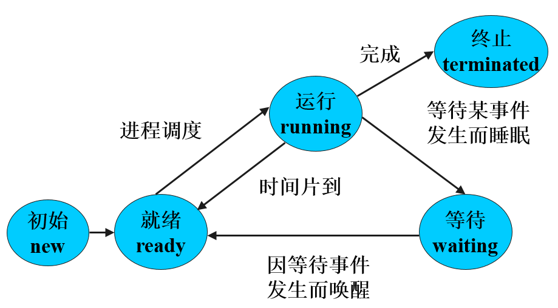

# 进程
+ 程序在某个数据集上的一次运行活动，是操作系统资源调度与分配的基本单位。
+ 进程的状态：
    
    + 初始状态
    + 就绪状态
    + 执行状态
    + 等待状态
    + 终止状态

+ 进程互斥
    + 间接制约
        + 由于共享某一共有资源而引起的在临界区内不允许进程交叉执行的现象，称为共享共有资源而造成的对并发进程执行速度的间接制约。
        + 只要是指个并发进程的速度受共有资源制约，而不是进程间直接制约。
    + 临界区
        + 由属于不同并发进程的程序段共享公用数据或公用数据变量二引起的。
    + PV原语实现进程互斥
        设信号量sem是用于互斥的信号量，且其初值为1表示没有并发进程使用该临界区。
        P<sub>A</sub>:
        ```
            P(sem)
            // 执行代码
            V(sem)
        ```
        P<sub>B</sub>:
        ```
            P(sem)
            // 执行代码
            V(sem)
        ```

+ 进程同步
    + 直接制约
        + 在异步环境下的并发进程，各自的执行结果互为对方的执行条件，从而限制个进程的执行速度的过程。
    + PV原语实现进程同步
        设公用信号量mutex保证生产者进程和消费者进程之间的互斥，
        设信号量avail为生产者进程的私用信号量，信号量full为消费者进程的私用信号量。
        信号量avail表示有界缓冲区中的空单元数，初值为n；信号量full表示有界缓冲区中的非空单元数，初值为0.
        ```
        deposit(data):
            begin
                P(avail)
                P(mutex)
                // 送数据到缓冲区单元
                V(full)
                V(mutex)
            end

        remove(data):
            begin
                P(full)
                P(mutex)
                // 从缓冲区中的数据
                V(avail)
                V(mutex)
            end
        ```

+ 进程通信
+ 进程死锁

---

# 线程
+ 线程是进程的一个实体，作为系统调度和分派的基本单位，它是比进程更小的能独立运行的基本单元。
+ 线程自己基本上不拥有系统资源，只拥有一点在运行中必不可少的资源（如程序计数器，一组寄存器和栈），但是它可与同属一个进程的其他的线程共享进程所拥有的全部资源。
+ 一个线程可以创建和撤销另一个线程，同一个进程中的多个线程之间可以并发执行。