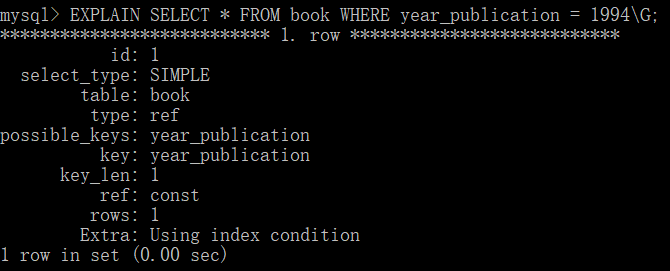
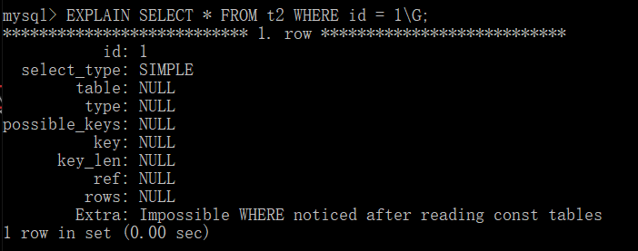
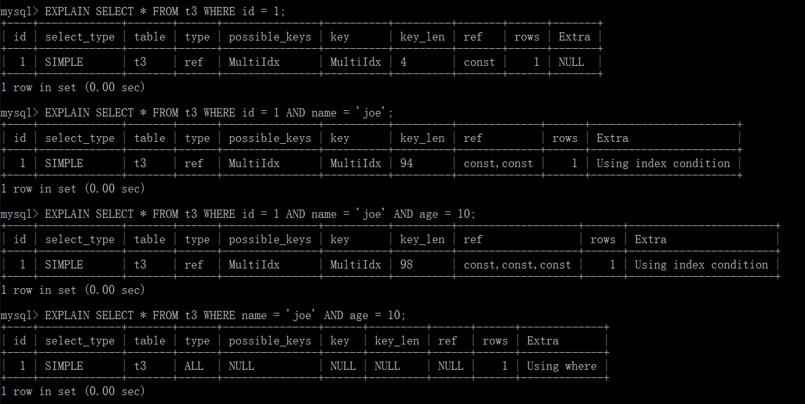

# 存储引擎
* ISAM：读取数据快，不支持事务、外键、容错
* MyISAM：基于ISAM，增加表锁
* heap：每个表对应一个磁盘文件，表结构存在磁盘，数据存在内存
* csv：基于普通文本文件，每个数据行占一个文本行
* blackhole：用作日志记录
* archive：提供压缩功能，适合存储大量的独立的历史数据，插入速度快，无索引查询慢
* performance schema：用于收集数据库服务器的参数
* InnoDB：提供ACID事务、系统奔溃修复能力、多版本并发控制的行级锁、支持自增长列、外键，5.5之后的默认引擎

## InnoDB MyISAM 区别
* 默认引擎：
    * 5.5之前：MyISAM
    * 5.5之后：InnoBD

* 存储结构
    * MyISAM：在磁盘上存储成三个文件
        1. .frm（表结构定义）
        1. .myd（数据）
        1. .myi（索引）
    * InnoBD：所有的表都保存在同一个数据文件中.frm（也可能是多个文件，或者是独立的表空间文件，这个具体要看独立表空间是否默认开启，如果默认开始（5.7已经默认），那便是多个文件），InnoDB表的大小只受限于操作系统文件的大小，一般为2GB。

* 存储空间
    * MyISAM：可被压缩，存储空间小。
        * 三种不同存储格式：
            1. 静态表（默认，没有varchar）
            1. 动态表（有varchar）
            1. 压缩表
    * InnoBD：需要更多的内存和存储。
        * 主内存中建立其专用的缓冲池用于高速缓冲数据和索引。

* 事务支持
    * MyISAM：强调的是性能，每次查询都具有原子性，执行速度比InnoBD快，但是不支持事务。
    * InnoBD：提供事务、外键等。具有事务、回滚(rollback)和崩溃修复能力的事务安全(ACID)型表。

* AUOT_INCREMENT
    * MyISAM：可以和其他字段建立联合索引。引擎的自动增长列必须是索引，如果是组合索引，自动增长列可以不是第一列。
    * InnoBD：必须包含只有该字段的索引。引擎的自动增长列必须是所以，如果是组合索引，自动增长列也必须是组合索引的第一列。

* 锁
    * MyISAM：只支持表级锁。
    * InnoBD：支持行级锁。只有在WHERE的主键是有效的，非主键的WHERE都会锁全表的。

* 支持的索引 B+Tree
    * MyISAM：非聚簇索引，叶子节点存储的是数据的地址
    * InnoBD：主键聚簇索引，叶子节点存储的是索引值和数据本身；二级索引不适用聚簇索引，叶子节点存储的是key字段加主键值。

* 全文索引
    * MyISAM：支持FULLTEXT的全文索引。
    * InnoDB：不支持FULLTEXT的全文索引。

* 表主键
    * MyISAM：允许没有任何主键和索引的表，索引都是保存行的地址。
    * InnoBD：如果没有设定主键或者非空唯一索引，就会自动生成一个6字节的ROWID，作为主键（用户不可见）

* 表行数
    * MyISAM：保存有表的行数，如果select count(*) from table;会直接取出出该值。
    * InnoBD：不保存表的行数，如果select count(*) from table;会遍历整个表。在加了where后，都需要遍历整个表。

* CRUD性能
    * MyISAM：查性能高，适合多查询。
    * InnoBD：增删改性能高。

# MVCC [参考](https://blog.csdn.net/whoamiyang/article/details/51901888)
## 简介
MVCC是一种多版本控制并发机制。
### 为了解决什么问题
锁机制可以控制并发操作，但是其系统开销较大，而MVCC可以在大多数情况下代替行级锁，使用MVCC，能降低其系统开销。
### 实现
通过保存数据在某个时间点的快照来实现的。

## 具体实现
InnDB的MVCC，是通过在每行记录的后面保存两个隐藏列来实现。
* 一列为创建时间版本
* 一列为删除时间版本
PS：这里的时间不是指具体的时间，是系统的版本号（可以理解为事务的ID），每开始一个新的事务，系统版本号就会自动递增，事务开始时刻的系统版本号，会作为事务的ID。
### SELECT
InnDB会根据一下两个条件检查每行记录：
1. 只会查找 行的 “创建时间版本” <= “当前事务版本” 的数据行
    可以确保事务读取的行，要么是事务开始之前就存在的，要么是事务自身插入或修改的。
1. 只会查找 行的 “删除时间版本” 要么未定义，要么 > “当前事务版本”
    确保事务读取到的行，在事务开始之前未被删除。
### INSERT
InnDB为新插入的每一行保存 “当前事务版本” 为 “创建时间版本”
### DELETE
不删除行
InnDB为删除的每一行保存 “当前事务版本” 为 “删除时间版本
### UPDATE
InnDB执行UPDATE，实际上是新插入了一行记录，
新插入行保存 “当前事务版本” 为 “创建时间版本” ，被UPDATE的行指向到回滚字段
被UPDATE的行 保存 “当前事务版本” 为 “删除时间版本”


# 存储过程 [参考](https://www.cnblogs.com/mark-chan/p/5384139.html)
是一组为了完成特定功能的SQL语句集，经编译后存储在数据库中，用户通过指定存储过程的名字并给定参数（如果该存储过程带有参数）来调用执行它。
存储过程是可编程的函数，在数据库中创建并保存，可以由SQL语句和控制结构组成。当想要在不同的应用程序或平台上执行相同的函数，或者封装特定功能时，存储过程是非常有用的。数据库中的存储过程可以看做是对编程中面向对象方法的模拟，它允许控制数据的访问方式。
## 优点
1. **增强SQL语言的功能和灵活性**：存储过程可以用控制语句编写，有很强的灵活性，可以完成复杂的判断和较复杂的运算。
1. **标准组件式编程**：存储过程被创建后，可以在程序中被多次调用，而不必重新编写该存储过程的SQL语句。而且数据库专业人员可以随时对存储过程进行修改，对应用程序源代码毫无影响。
1. **较快的执行速度**：如果某一操作包含大量的Transaction-SQL代码或分别被多次执行，那么存储过程要比批处理的执行速度快很多。因为存储过程是预编译的。在首次运行一个存储过程时查询，优化器对其进行分析优化，并且给出最终被存储在系统表中的执行计划。而批处理的Transaction-SQL语句在每次运行时都要进行编译和优化，速度相对要慢一些。
1. 减少网络流量
1. 作为一种安全机制来充分利用：通过对执行某一存储过程的权限进行限制，能够实现对相应的数据的访问权限的限制，避免了非授权用户对数据的访问，保证了数据的安全。

## 创建
语法：
```SQL
CREATE PROCEDURE 过程名([[IN|OUT|INOUT] 参数名 数据类型[,[IN|OUT|INOUT] 参数名 数据类型...]]) [特性 ..] 过程体
```
```SQL
DELIMITER //    # 声明段分隔符
    CREATE PROCEDURE myproc(OUT s int)
        BEGIN
            SELECT COUNT(*) INTO s FROM students;
        END
        //
DELIMITER ;     # 把分隔符还原
```
* 分隔符
    MySQL默认以";"为分隔符，如果没有声明分隔符，则编译器会把存储过程当成SQL语句进行处理，因此编译过程报错，所以要事先用"DELIMITER //"声明当前段分隔符，让编译器把两个"//"之间的内容当做存储过程的代码，不会执行这些代码。
* 参数
    存储过程根据需要可能会有输入、输出、输入输出参数，如果有多个参数用","分割开。MySQL存储过程的参数用在存储过程的定义，共有三种参数类型,IN,OUT,INOUT:
    * IN 参数的值必须在调用存储过程时指定，在存储过程中修改该参数的值不能被返回，为默认值
    * OUT 改值可在存储过程内部被改变，并可返回
    * INOUT 调用时指定，并且可被改变和返回
* 过程体
    过程体的开始与结束使用BEGIN与END进行标识。

## 例子
* IN
    ```SQL
    DELIMITER //
    CREATE PROCEDURE in_param ( IN p_in INT )
        BEGIN 
            SELECT p_in;
            SET p_in = 2;
            SELECT p_in;
        END;
        //
    DELIMITER //

    # 调用
    SET @p_in=1;
    CALL in_param(@p_in);
    SELECT @p_in;
    ```

* OUT
    ```SQL
    DELIMITER //
    CREATE PROCEDURE out_param(OUT p_out int)
        BEGIN
        SELECT p_out;
        SET p_out=2;
        SELECT p_out;
        END;
        //
    DELIMITER ;

    # 调用
    SET @p_out=1;
    CALL out_param(@p_out);
    SELECT @p_out;
    ```

* INOUT
    ```SQL
    DELIMITER //
    CREATE PROCEDURE inout_param(INOUT p_inout int)
        BEGIN
        SELECT p_inout;
        SET p_inout=2;
        SELECT p_inout;
        END;
        //
    DELIMITER ;
    #调用
    SET @p_inout=1;
    CALL inout_param(@p_inout) ;
    SELECT @p_inout;
    ```

# 索引
## 分类
* 单列索引：一个索引只包含单个列，但一个表中可以有多个单列索引。 
    * 普通索引：基本索引类型，允许有空值和重复值。
    * 唯一索引：索引列中的值必须是唯一，但可以为空。
    * 主键索引：是一种特殊的唯一索引，不允许有空值。
* 组合索引：在表中多个字段组合上创建的索引。只有在查询中使用了这个索引中的最左字段，索引才会被使用，使用组合索引时遵循最左前缀原则。
* 覆盖索引：跟联合索引有点类似，就是在查询t的时候只用去**读取索引key**而取得数据，无需进行二次查询相关表。
* 全文索引：只有在MyISAM引擎上才能使用，只能在CHAR,VARCHAR,TEXT类型字段上使用全文索引；在一堆文字中，通过其中的某个关键字等，就能找到该字段所属的记录行，比如有"你是个大煞笔，二货 ..." 通过大煞笔，可能就可以找到该条记录。

## B-TREE 和 HASH 索引对比
### B-TREE


## 优缺点和使用原则
* 优点
    1. 可以通过建立唯一索引或者主键索引,保证数据库表中每一行数据的唯一性.
    1. 建立索引可以大大提高检索的数据,以及减少表的检索行数
    1. 在表连接的连接条件 可以加速表与表直接的相连 
    1. 在分组和排序字句进行数据检索,可以减少查询时间中 分组 和 排序时所消耗的时间(数据库的记录会重新排序)
    1. 建立索引,在查询中使用索引 可以提高性能
* 缺点
    1. 在创建索引和维护索引 会耗费时间,随着数据量的增加而增加
    1. 索引文件会占用物理空间,除了数据表需要占用物理空间之外,每一个索引还会占用一定的物理空间
    1. 当对表的数据进行 INSERT,UPDATE,DELETE 的时候,索引也要动态的维护,这样就会降低数据的维护速度,(建立索引会占用磁盘空间的索引文件。一般情况这个问题不太严重，但如果你在一个大表上创建了多种组合索引，索引文件的会膨胀很快)。
* 需要注意的地方
    1. 在经常需要排序(order by),分组(group by)和的distinct 列上加索引 可以加快排序查询的时间,  (单独order by 用不了索引，索引考虑加where 或加limit)
    1. 在一些where 之后的 < <= > >= BETWEEN IN 以及某个情况下的like(不以%、_开头的，如下)建立字段的索引(B-TREE)
    1. like语句的 如果你对nickname字段建立了一个索引.当查询的时候的语句是 nickname lick '%ABC%' 那么这个索引讲不会起到作用.而nickname lick 'ABC%' 那么将可以用到索引
    1. **索引不会包含NULL列**,如果列中包含NULL值都将不会被包含在索引中,复合索引中如果有一列含有NULL值那么这个组合索引都将失效,一般需要给默认值0或者 ' '字符串
    1. 使用短索引,如果你的一个字段是Char(32)或者int(32),在创建索引的时候指定前缀长度 比如前10个字符 (前提是多数值是唯一的..)那么短索引可以提高查询速度,并且可以减少磁盘的空间,也可以减少I/0操作.
* 不创建索引
    1. 查询中很少使用到的列
    1. 很少数据的列也不应该建立索引,比如 一个性别字段 0或者1
    1. 定义为text和image和bit数据类型的列不应该增加索引
    1. 当表的修改(UPDATE,INSERT,DELETE)操作远远大于检索(SELECT)操作时不应该创建索引

## 操作
* 创建
    * 创建表时创建
        格式：
        ```SQL
        [索引类型] [INDEX|KEY] [索引名字] [字段名[length]] [ASC|DES] 
        ```
        ```SQL
        CREATE TABLE `xxx` (
            id_number int NOT NULL,
            # ...
            [UNIQUE|FULLTEXT|SPATIAL|...] [KEY|INDEX] [`id_number` ](`id_number`) [ASC|DESC]
        )
        ```
    * 在已经存在的表上创建索引
        格式：
        ```SQL
        ALTER TABLE 表名 ADD [索引类型] [INDEX|KEY] [索引名字] [字段名[length]] [ASC|DES]
        CREATE [UNIQUE|FULLTEXT|SPATIAL] [INDEX|KEY] 索引名称 ON 表名(创建索引的字段名[length]) [ASC|DESC]
        ```

* 删除
    * 格式：
        ```SQL
        ALTER TABLE 表名 DROP INDEX 索引名
        DROP INDEX 索引名 ON 表名
        ```

## 示例
### 普通索引
```SQL
CREATE TABLE book
(
    bookid INT NOT NULL,
    bookname VARCHAR(255) NOT NULL,
    authors VARCHAR(255) NOT NULL,
    info VARCHAR(255) NULL,
    comment VARCHAR(255) NULL,　
    year_publication YEAR NOT NULL,
    INDEX(year_publication)
);
```

最主要的是看possible_keys和key 这两个属性，上面显示了key为year_publication。说明使用了索引。

* id:　SELECT识别符。这是SELECT的查询序列号,也就是一条语句中，该select是第几次出现。在次语句中，select就只有一个，所以是1.
* select_type:所使用的SELECT查询类型，SIMPLE表示为简单的SELECT，不实用UNION或子查询，就为简单的SELECT。也就是说在该SELECT查询时会使用索引。其他取值，PRIMARY：最外面的SELECT.在拥有子查询时，就会出现两个以上的SELECT。UNION：union(两张表连接)中的第二个或后面的select语句  SUBQUERY：在子查询中，第二SELECT。
* table：数据表的名字。他们按被读取的先后顺序排列，这里因为只查询一张表，所以只显示book
* type：指定本数据表和其他数据表之间的关联关系，该表中所有符合检索值的记录都会被取出来和从上一个表中取出来的记录作联合。ref用于连接程序使用键的最左前缀或者是该键不是 primary key 或 unique索引（换句话说，就是连接程序无法根据键值只取得一条记录）的情况。当根据键值只查询到少数几条匹配的记录时，这就是一个不错的连接类型。(注意，个人这里不是很理解，百度了很多资料，全是大白话，等以后用到了这类信息时，在回过头来补充，这里不懂对后面的影响不大。)可能的取值有 system、const、eq_ref、index和All
* possible_keys：MySQL在搜索数据记录时可以选用的各个索引，该表中就只有一个索引，year_publication
* key：实际选用的索引
* key_len：显示了mysql使用索引的长度(也就是使用的索引个数)，当 key 字段的值为 null时，索引的长度就是 null。注意，key_len的值可以告诉你在联合索引中mysql会真正使用了哪些索引。这里就使用了1个索引，所以为1，
* ref:给出关联关系中另一个数据表中数据列的名字。常量（const），这里使用的是1990，就是常量。
* rows：MySQL在执行这个查询时预计会从这个数据表里读出的数据行的个数。
* extra：提供了与关联操作有关的信息，没有则什么都不写。

### 唯一索引
```SQL
CREATE TABLE t1
(
    id INT NOT NULL,
    name CHAR(30) NOT NULL,
    UNIQUE INDEX UniqIdx(id)
);
```

通过id查询时，会使用唯一索引。并且还实验了查询一个没有的id值，则不会使用索引，原因应该是所有的id应该会存储到一个const tables中，到其中并没有该id值，那么就没有查找的必要了。

### 主键索引
```SQL
CREATE TABLE t2
(
    id INT NOT NULL,
    name CHAR(10),
    PRIMARY KEY(id)
);　
```


### 组合索引
```SQL
CREATE TABLE t3
(
    id INT NOT NULL,
    name CHAR(30) NOT NULL,
    age INT NOT NULL,
    info VARCHAR(255),
    INDEX MultiIdx(id,name,age)
);
```

* Table:创建索引的表
* Non_unique：表示索引非唯一，1代表 非唯一索引， 0代表 唯一索引，意思就是该索引是不是唯一索引
* Key_name：索引名称
* Seq_in_index：表示该字段在索引中的位置，单列索引的话该值为1，组合索引为每个字段在索引定义中的顺序(这个只需要知道单列索引该值就为1，组合索引为别的)
* Column_name：表示定义索引的列字段
* Sub_part：表示索引的长度
* Null：表示该字段是否能为空值
* Index_type：表示索引类型


最左前缀原则